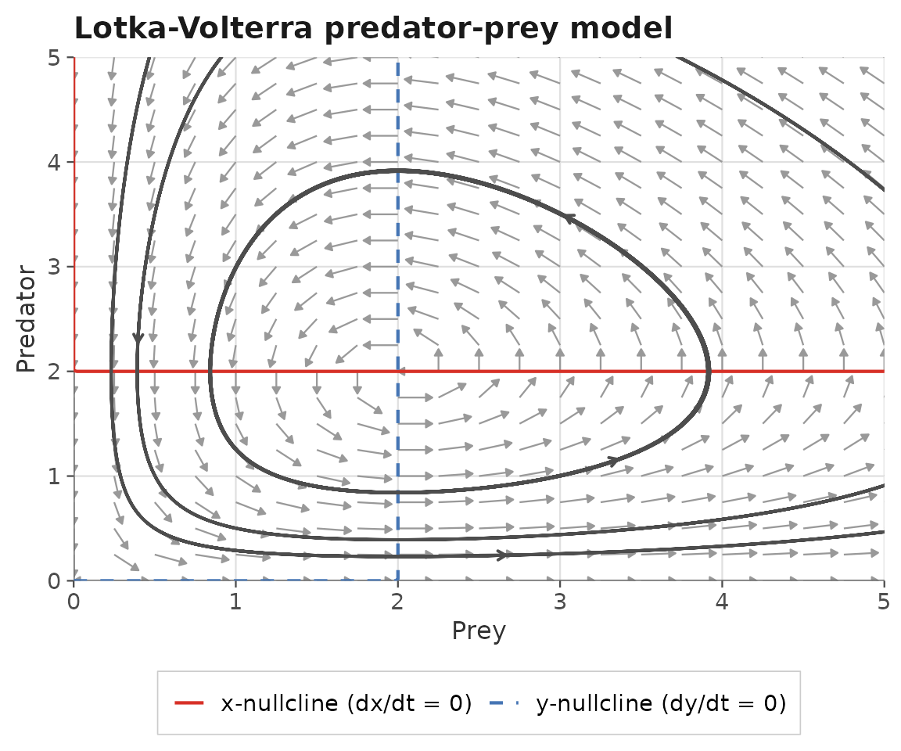
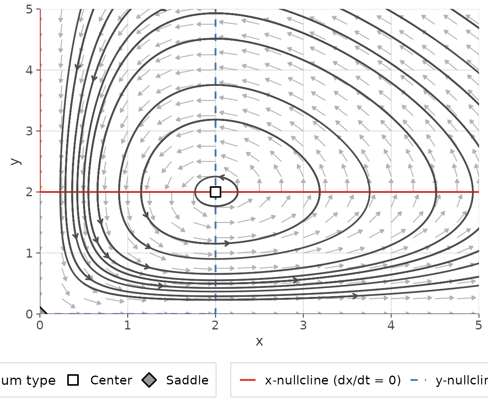
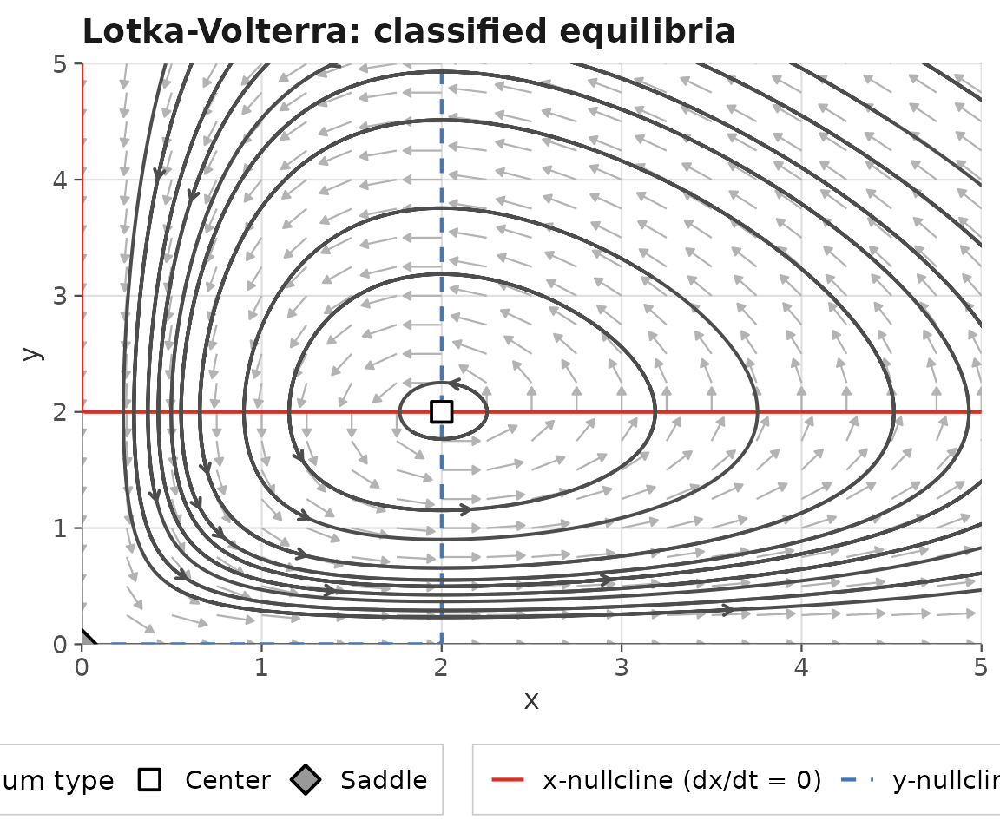
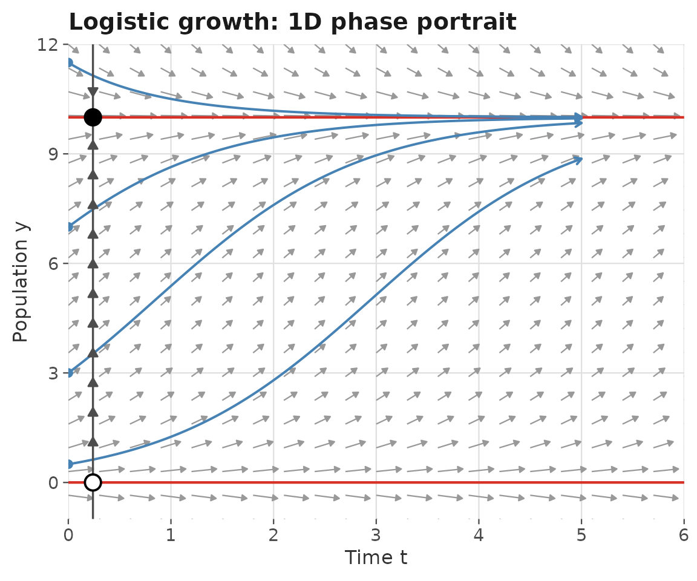
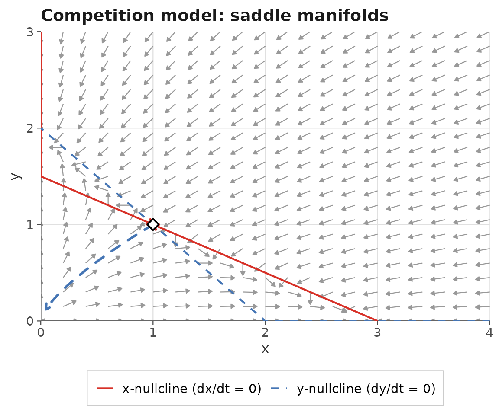

# Introduction to ggphasr

## What is ggphasr?

`ggphasr` provides tools for **qualitative analysis of one- and
two-dimensional autonomous ordinary differential equation (ODE)
systems** using phase plane methods. It is a modern successor to the
[phaseR](https://github.com/mjg211/phaseR) package (Grayling, 2014),
with two key improvements:

1.  All visualizations are produced with **ggplot2** and its extensions,
    making every plot fully customizable with standard ggplot2 syntax.
2.  The package is distributed via **GitHub** rather than CRAN, ensuring
    it remains installable regardless of CRAN archival policies.

`ggphasr` is designed for **students and instructors** in applied
mathematics, mathematical modeling, differential equations, and
dynamical systems courses. Plots compose naturally using the `+`
operator — the same way all ggplot2 plots are built — so students
already familiar with ggplot2 can immediately adapt and extend any phase
portrait.

``` r

library(ggphasr)
library(ggplot2)
```

------------------------------------------------------------------------

## Installation

``` r

# install.packages("remotes")
remotes::install_github("jmgraham30/ggphasr")
```

------------------------------------------------------------------------

## ODE conventions

`ggphasr` accepts ODE functions in two calling conventions.

**Convention A** — deSolve-compatible (recommended):

``` r

my_ode <- function(t, y, parameters) {
  # y[1] = x, y[2] = y (for 2D systems)
  # parameters = named numeric vector
  list(c(
    f(y[1], y[2]),   # dx/dt
    g(y[1], y[2])    # dy/dt
  ))
}
```

**Convention B** — simplified, for quick exploration:

``` r

# 2D:
my_ode <- function(x, y, parameters = NULL) c(dx, dy)

# 1D:
my_ode <- function(y, parameters = NULL) dy
```

The calling convention is detected automatically from the function’s
argument names, so both styles work with all `ggphasr` functions.
Convention A is directly compatible with
[`deSolve::ode()`](https://rdrr.io/pkg/deSolve/man/ode.html).

------------------------------------------------------------------------

## The composable workflow

The core workflow builds a phase portrait layer by layer using `+`, just
like standard ggplot2:

``` r

lv_params <- c(alpha = 1, beta = 0.5, delta = 0.5, gamma = 1)

gg_flow_field(
  ode_lotka_volterra,
  xlim       = c(0, 5),
  ylim       = c(0, 5),
  parameters = lv_params,
  xlab       = "Prey",
  ylab       = "Predator",
  title      = "Lotka-Volterra predator-prey model"
) +
  gg_nullclines(
    ode_lotka_volterra,
    xlim            = c(0, 5),
    ylim            = c(0, 5),
    parameters      = lv_params,
    legend_position = "bottom"
  ) +
  gg_trajectory(
    ode_lotka_volterra,
    y0         = matrix(c(0.5, 0.5,
                          1.0, 3.0,
                          3.5, 0.5,
                          3.0, 3.5),
                        ncol = 2, byrow = TRUE),
    xlim       = c(0, 5),
    ylim       = c(0, 5),
    parameters = lv_params,
    t_end      = 25,
    color      = "grey30",
    add_start_point = FALSE
  )
```



Each function in this chain has a specific role:

- [`gg_flow_field()`](https://jmgraham30.github.io/ggphasr/reference/gg_flow_field.md)
  — creates the base ggplot object with direction arrows showing the
  vector field $`(dx/dt, dy/dt)`$ at each grid point. It returns a
  complete `ggplot` object.
- [`gg_nullclines()`](https://jmgraham30.github.io/ggphasr/reference/gg_nullclines.md)
  — adds the x-nullcline (where $`dx/dt = 0`$, red) and y-nullcline
  (where $`dy/dt = 0`$, blue). Returns a list of ggplot2 layers.
- [`gg_trajectory()`](https://jmgraham30.github.io/ggphasr/reference/gg_trajectory.md)
  — numerically integrates the ODE from the supplied initial conditions
  using `deSolve` and adds the solution paths. Returns a list of ggplot2
  layers.

Because
[`gg_nullclines()`](https://jmgraham30.github.io/ggphasr/reference/gg_nullclines.md)
and
[`gg_trajectory()`](https://jmgraham30.github.io/ggphasr/reference/gg_trajectory.md)
return layer lists rather than complete ggplot objects, they compose
naturally with `+` just as any ggplot2 geom would.

------------------------------------------------------------------------

## The all-in-one wrapper

For quick exploration,
[`gg_phase_plane()`](https://jmgraham30.github.io/ggphasr/reference/gg_phase_plane.md)
produces a complete phase portrait — flow field, nullclines,
trajectories from a grid of initial conditions, and classified
equilibria — in a single call:

``` r

result <- gg_phase_plane(
  ode_lotka_volterra,
  xlim            = c(0, 5),
  ylim            = c(0, 5),
  parameters      = lv_params,
  legend_position = "bottom"
)

result$plot
```



[`gg_phase_plane()`](https://jmgraham30.github.io/ggphasr/reference/gg_phase_plane.md)
returns a named list with two components:

- `$plot` — the ggplot object, which can be further customized with `+`
- `$equilibria` — a tidy data frame of classified equilibria

``` r

result$equilibria[, c("x", "y", "classification", "tr", "det")]
#>   x y classification tr det
#> 1 0 0         Saddle  0  -1
#> 2 2 2         Center  0   1
```

The
[`add_layer()`](https://jmgraham30.github.io/ggphasr/reference/add_layer.md)
function adds ggplot2 layers to the result while preserving
`$equilibria`:

``` r

add_layer(result, labs(title = "Lotka-Volterra: classified equilibria"))$plot
```



------------------------------------------------------------------------

## 1D systems

For one-dimensional systems, `system = "one.dim"` switches all functions
to phase line mode.
[`gg_phase_portrait()`](https://jmgraham30.github.io/ggphasr/reference/gg_phase_portrait.md)
adds the traditional phase line with directional arrows and stability
markers:

``` r

gg_flow_field(
  ode_logistic,
  xlim       = c(0, 6),
  ylim       = c(-1, 12),
  system     = "one.dim",
  parameters = c(r = 1, K = 10),
  xlab       = "Time t",
  ylab       = "Population y",
  title      = "Logistic growth: 1D phase portrait"
) +
  gg_nullclines(
    ode_logistic,
    xlim       = c(0, 6),
    ylim       = c(-1, 12),
    system     = "one.dim",
    parameters = c(r = 1, K = 10)
  ) +
  gg_trajectory(
    ode_logistic,
    y0         = list(c(0.5), c(3), c(7), c(11.5)),
    xlim       = c(0, 6),
    ylim       = c(-1, 12),
    system     = "one.dim",
    parameters = c(r = 1, K = 10),
    t_end      = 5,
    color      = "steelblue"
  ) +
  gg_phase_portrait(
    ode_logistic,
    ylim       = c(-1, 12),
    xlim       = c(0, 6),
    parameters = c(r = 1, K = 10)
  )
```



------------------------------------------------------------------------

## Equilibrium analysis

[`find_equilibrium()`](https://jmgraham30.github.io/ggphasr/reference/find_equilibrium.md)
and
[`classify_equilibrium()`](https://jmgraham30.github.io/ggphasr/reference/classify_equilibrium.md)
provide numerical tools for locating and classifying equilibria:

``` r

# Find equilibria by grid search
eq_list <- find_equilibrium(
  ode_lotka_volterra,
  y0         = NULL,
  xlim       = c(0, 5),
  ylim       = c(0, 5),
  parameters = lv_params
)

# Classify each equilibrium
do.call(rbind, lapply(eq_list, function(eq) {
  classify_equilibrium(ode_lotka_volterra,
                       equilibrium = eq,
                       parameters  = lv_params)
}))[, c("x", "y", "classification", "tr", "det")]
#>   x y classification tr det
#> 1 0 0         Saddle  0  -1
#> 2 2 2         Center  0   1
```

------------------------------------------------------------------------

## Stable and unstable manifolds

[`gg_manifolds()`](https://jmgraham30.github.io/ggphasr/reference/gg_manifolds.md)
draws the stable and unstable manifolds of saddle points, which organize
the phase plane into basins of attraction:

``` r

eq    <- find_equilibrium(ode_example_11, y0 = c(0.8, 0.8))
eq_cl <- classify_equilibrium(ode_example_11, equilibrium = eq[[1L]])

gg_flow_field(ode_example_11,
              xlim  = c(0, 4),
              ylim  = c(0, 3),
              title = "Competition model: saddle manifolds") +
  gg_nullclines(ode_example_11,
                xlim            = c(0, 4),
                ylim            = c(0, 3),
                legend_position = "bottom") +
  gg_manifolds(ode_example_11,
               equilibrium   = eq[[1L]],
               eq_classified = eq_cl,
               t_manifold    = 5)
#> DLSODA-  Warning..Internal T (=R1) and H (=R2) are
#>       such that in the machine, T + H = T on the next step  
#>      (H = step size). Solver will continue anyway.
#> In above message, R1 = -3.96058, R2 = -1.90518e-16
#>  
#> DLSODA-  Warning..Internal T (=R1) and H (=R2) are
#>       such that in the machine, T + H = T on the next step  
#>      (H = step size). Solver will continue anyway.
#> In above message, R1 = -3.96058, R2 = -1.90518e-16
#>  
#> DLSODA-  Warning..Internal T (=R1) and H (=R2) are
#>       such that in the machine, T + H = T on the next step  
#>      (H = step size). Solver will continue anyway.
#> In above message, R1 = -3.96058, R2 = -1.90518e-16
#>  
#> DLSODA-  Warning..Internal T (=R1) and H (=R2) are
#>       such that in the machine, T + H = T on the next step  
#>      (H = step size). Solver will continue anyway.
#> In above message, R1 = -3.96058, R2 = -1.52334e-16
#>  
#> DLSODA-  Warning..Internal T (=R1) and H (=R2) are
#>       such that in the machine, T + H = T on the next step  
#>      (H = step size). Solver will continue anyway.
#> In above message, R1 = -3.96058, R2 = -1.52334e-16
#>  
#> DLSODA-  Warning..Internal T (=R1) and H (=R2) are
#>       such that in the machine, T + H = T on the next step  
#>      (H = step size). Solver will continue anyway.
#> In above message, R1 = -3.96058, R2 = -1.26208e-16
#>  
#> DLSODA-  Warning..Internal T (=R1) and H (=R2) are
#>       such that in the machine, T + H = T on the next step  
#>      (H = step size). Solver will continue anyway.
#> In above message, R1 = -3.96058, R2 = -1.26208e-16
#>  
#> DLSODA-  Warning..Internal T (=R1) and H (=R2) are
#>       such that in the machine, T + H = T on the next step  
#>      (H = step size). Solver will continue anyway.
#> In above message, R1 = -3.96058, R2 = -1.26208e-16
#>  
#> DLSODA-  Warning..Internal T (=R1) and H (=R2) are
#>       such that in the machine, T + H = T on the next step  
#>      (H = step size). Solver will continue anyway.
#> In above message, R1 = -3.96058, R2 = -1.00913e-16
#>  
#> DLSODA-  Warning..Internal T (=R1) and H (=R2) are
#>       such that in the machine, T + H = T on the next step  
#>      (H = step size). Solver will continue anyway.
#> In above message, R1 = -3.96058, R2 = -1.00913e-16
#>  
#> DLSODA-  Above warning has been issued I1 times.  
#>      It will not be issued again for this problem.
#> In above message, I1 = 10
#>  
#> DLSODA-  At T (=R1), too much accuracy requested  
#>       for precision of machine..  See TOLSF (=R2) 
#> In above message, R1 = -3.96058, R2 = nan
#> 
```



------------------------------------------------------------------------

## Built-in ODE systems

`ggphasr` includes 27 built-in ODE systems ready to use without writing
any equations:

**1D growth models** (4):
[`ode_exponential()`](https://jmgraham30.github.io/ggphasr/reference/ode_exponential.md),
[`ode_logistic()`](https://jmgraham30.github.io/ggphasr/reference/ode_logistic.md),
[`ode_monomolecular()`](https://jmgraham30.github.io/ggphasr/reference/ode_monomolecular.md),
[`ode_von_bertalanffy()`](https://jmgraham30.github.io/ggphasr/reference/ode_von_bertalanffy.md)

**Classical 2D models** (8):
[`ode_lotka_volterra()`](https://jmgraham30.github.io/ggphasr/reference/ode_lotka_volterra.md),
[`ode_sir()`](https://jmgraham30.github.io/ggphasr/reference/ode_sir.md),
[`ode_van_der_pol()`](https://jmgraham30.github.io/ggphasr/reference/ode_van_der_pol.md),
[`ode_simple_pendulum()`](https://jmgraham30.github.io/ggphasr/reference/ode_simple_pendulum.md),
[`ode_competition()`](https://jmgraham30.github.io/ggphasr/reference/ode_competition.md),
[`ode_toggle()`](https://jmgraham30.github.io/ggphasr/reference/ode_toggle.md),
[`ode_morris_lecar()`](https://jmgraham30.github.io/ggphasr/reference/ode_morris_lecar.md),
[`ode_lindemann()`](https://jmgraham30.github.io/ggphasr/reference/ode_lindemann.md)

**Textbook examples** (15):
[`ode_example_01()`](https://jmgraham30.github.io/ggphasr/reference/ode_example_01.md)
through
[`ode_example_15()`](https://jmgraham30.github.io/ggphasr/reference/ode_example_15.md)
— a library of 1D and 2D systems covering all common equilibrium types
(stable/unstable nodes, spirals, centers, saddles, and limit cycles).

All built-in systems use Convention A and can be passed directly to any
`ggphasr` plotting or analysis function.

------------------------------------------------------------------------

## Function reference

### Plotting

| Function | Returns | Description |
|----|----|----|
| [`gg_flow_field()`](https://jmgraham30.github.io/ggphasr/reference/gg_flow_field.md) | `ggplot` | Direction/velocity field |
| [`gg_nullclines()`](https://jmgraham30.github.io/ggphasr/reference/gg_nullclines.md) | layer list | Nullcline curves |
| [`gg_trajectory()`](https://jmgraham30.github.io/ggphasr/reference/gg_trajectory.md) | layer list | Solution trajectories |
| [`gg_phase_portrait()`](https://jmgraham30.github.io/ggphasr/reference/gg_phase_portrait.md) | layer list | 1D phase line |
| [`gg_time_series()`](https://jmgraham30.github.io/ggphasr/reference/gg_time_series.md) | `ggplot` | Time-series plots |
| [`gg_manifolds()`](https://jmgraham30.github.io/ggphasr/reference/gg_manifolds.md) | layer list | Stable/unstable manifolds |
| [`gg_phase_plane()`](https://jmgraham30.github.io/ggphasr/reference/gg_phase_plane.md) | `ggphasr_result` | All-in-one wrapper |

### Analysis

| Function | Returns | Description |
|----|----|----|
| [`find_equilibrium()`](https://jmgraham30.github.io/ggphasr/reference/find_equilibrium.md) | list | Newton–Raphson root-finding |
| [`classify_equilibrium()`](https://jmgraham30.github.io/ggphasr/reference/classify_equilibrium.md) | data frame | Stability classification |
| [`add_layer()`](https://jmgraham30.github.io/ggphasr/reference/add_layer.md) | `ggphasr_result` | Add layers to a result object |

### Theme

| Function | Returns | Description |
|----|----|----|
| [`theme_phase_plane()`](https://jmgraham30.github.io/ggphasr/reference/theme_phase_plane.md) | `theme` | ggplot2 theme for phase portraits |

------------------------------------------------------------------------

## Further reading

The three topic vignettes provide full mathematical exposition and
detailed worked examples:

Three vignettes provide detailed tutorials with full mathematical
exposition:

- [**One-Dimensional ODE
  Systems**](https://jmgraham30.github.io/ggphasr/articles/one-dimensional-systems.html)
  — phase lines, equilibria, stability, the logistic and von Bertalanffy
  growth models
- [**Two-Dimensional ODE
  Systems**](https://jmgraham30.github.io/ggphasr/articles/two-dimensional-systems.html)
  — phase planes, nullclines, trajectories, Lotka-Volterra, SIR, Van der
  Pol, competition
- [**Equilibrium
  Analysis**](https://jmgraham30.github.io/ggphasr/articles/equilibrium-analysis.html)
  — Jacobian linearization, the trace-determinant plane, manifolds,
  bifurcation preview

------------------------------------------------------------------------

## References

Grayling MJ (2014). phaseR: An R Package for Phase Plane Analysis of
Autonomous ODE Systems. *The R Journal* **6**(2): 43–51.
<https://doi.org/10.32614/RJ-2014-023>

Strogatz SH (2015). *Nonlinear Dynamics and Chaos* (2nd ed.). Westview
Press.
