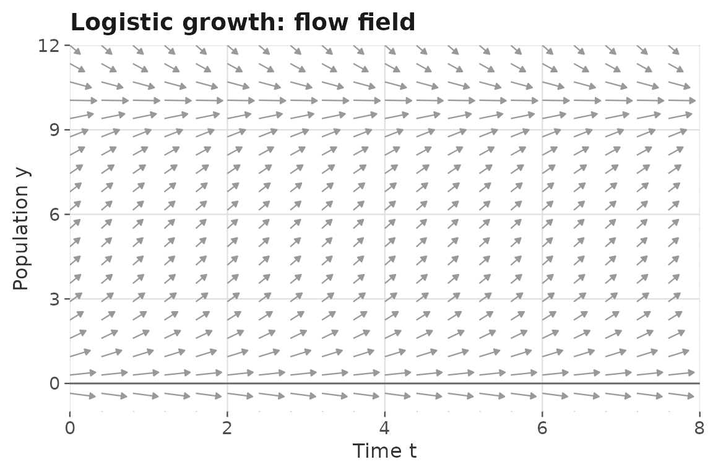
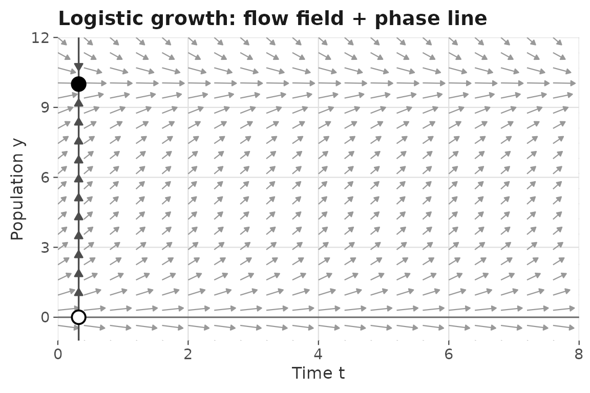
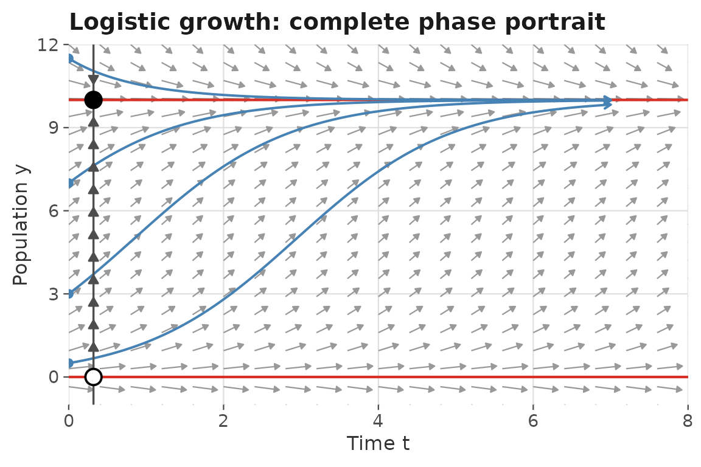
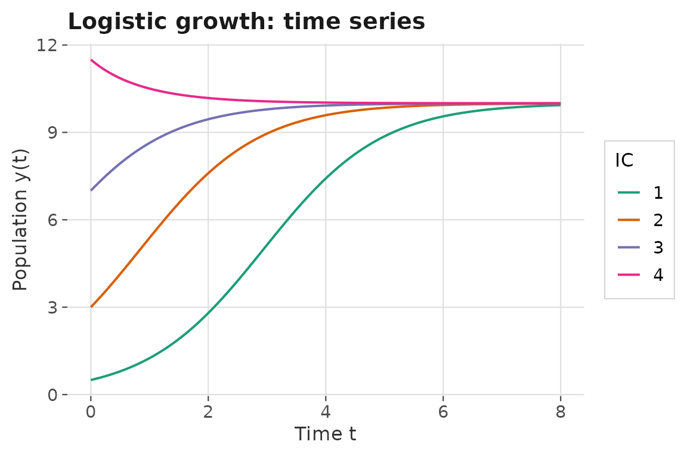
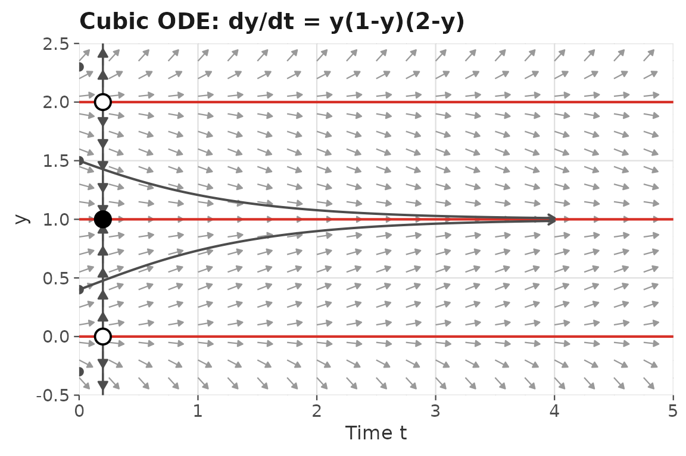
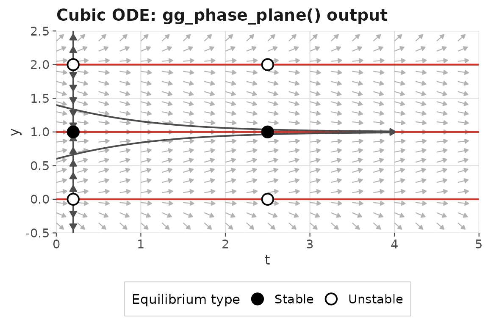
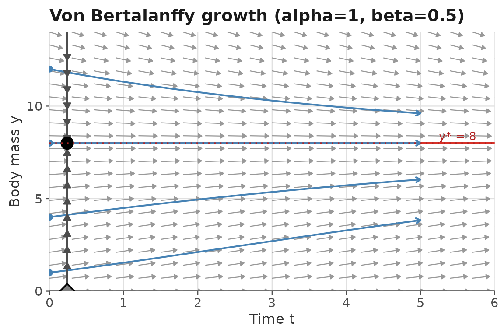

# One-Dimensional ODE Systems

## Introduction

A **one-dimensional autonomous ODE** has the form

``` math
\frac{dy}{dt} = f(y),
```

where the derivative depends only on the current state $`y`$, not on
time $`t`$ directly. Despite their simplicity, 1D autonomous systems
already exhibit rich qualitative behavior: exponential growth or decay,
logistic saturation, bistability, and more.

**Phase line analysis** is the standard tool for understanding these
systems without solving them explicitly. The key idea is to plot
$`f(y)`$ as a function of $`y`$, identify where $`f(y) = 0`$ (the
equilibria), and read off the direction of flow from the sign of
$`f(y)`$.

This vignette shows how to carry out a complete 1D phase analysis using
`ggphasr`. We cover:

1.  Defining 1D ODE systems in `ggphasr`
2.  Plotting the flow field and phase line
3.  Adding nullclines and trajectories
4.  Using
    [`find_equilibrium()`](https://jmgraham30.github.io/ggphasr/reference/find_equilibrium.md)
    and
    [`classify_equilibrium()`](https://jmgraham30.github.io/ggphasr/reference/classify_equilibrium.md)
5.  The
    [`gg_phase_plane()`](https://jmgraham30.github.io/ggphasr/reference/gg_phase_plane.md)
    all-in-one wrapper
6.  Worked examples: logistic growth, a user-defined cubic, and the von
    Bertalanffy growth model

``` r

library(ggphasr)
library(ggplot2)
```

------------------------------------------------------------------------

## 1 Defining a 1D ODE in ggphasr

`ggphasr` accepts ODE functions in two conventions.

**Convention A** (deSolve-compatible, recommended):

``` r

f <- function(t, y, parameters) {
  r <- parameters[["r"]]
  K <- parameters[["K"]]
  list(c(r * y[1] * (1 - y[1] / K)))
}
```

- First argument is time `t` (present for deSolve compatibility, but
  ignored in autonomous systems).
- Second argument `y` is a numeric vector of state variables (length 1
  for 1D systems).
- Third argument `parameters` is a named numeric vector of model
  parameters.
- Return value is a **list** whose first element is a numeric vector of
  derivatives.

**Convention B** (simplified, for quick exploration):

``` r

f <- function(y, parameters = NULL) {
  r * y * (1 - y / K)
}
```

- No time argument.
- Returns a plain numeric scalar, not a list.
- `ggphasr` detects Convention B automatically and wraps it into
  Convention A internally.

> **Note for advanced users:** Convention A is directly compatible with
> [`deSolve::ode()`](https://rdrr.io/pkg/deSolve/man/ode.html), which
> underpins all numerical integration in `ggphasr`. Convention B is a
> convenience wrapper; under the hood it is converted to Convention A
> before any computation.

Throughout this vignette we use the built-in
[`ode_logistic()`](https://jmgraham30.github.io/ggphasr/reference/ode_logistic.md)
and define a few custom systems to illustrate both conventions.

------------------------------------------------------------------------

## 2 The logistic growth model

The logistic (Verhulst) model is the classic 1D ODE for bounded
population growth:

``` math
\frac{dy}{dt} = r\,y\!\left(1 - \frac{y}{K}\right),
```

where $`y(t)`$ is population size, $`r > 0`$ is the intrinsic growth
rate, and $`K > 0`$ is the carrying capacity.

The model has two equilibria: $`y^* = 0`$ (unstable — populations near
zero grow away from it) and $`y^* = K`$ (stable — populations near $`K`$
return to it). The analytic solution is the familiar S-shaped logistic
curve

``` math
y(t) = \frac{K}{1 + \left(\frac{K - y_0}{y_0}\right)e^{-rt}}.
```

### 2.1 Flow field

[`gg_flow_field()`](https://jmgraham30.github.io/ggphasr/reference/gg_flow_field.md)
with `system = "one.dim"` plots the direction field: arrows in the
$`(t, y)`$ plane showing whether $`y`$ is increasing or decreasing at
each point.

``` r

gg_flow_field(
  ode_logistic,
  xlim       = c(0, 8),
  ylim       = c(-1, 12),
  system     = "one.dim",
  parameters = c(r = 1, K = 10),
  xlab       = "Time t",
  ylab       = "Population y",
  title      = "Logistic growth: flow field"
)
```



Notice that arrows point upward (y increasing) for $`0 < y < 10`$ and
downward (y decreasing) for $`y > 10`$, reflecting the two equilibria.

### 2.2 Adding the phase line

[`gg_phase_portrait()`](https://jmgraham30.github.io/ggphasr/reference/gg_phase_portrait.md)
adds the traditional phase line — a vertical reference line with
directional arrows and stability markers:

- **Filled circle** = stable equilibrium (arrows point toward it)
- **Open circle** = unstable equilibrium (arrows point away from it)

``` r

gg_flow_field(
  ode_logistic,
  xlim       = c(0, 8),
  ylim       = c(-1, 12),
  system     = "one.dim",
  parameters = c(r = 1, K = 10),
  xlab       = "Time t",
  ylab       = "Population y",
  title      = "Logistic growth: flow field + phase line"
) +
  gg_phase_portrait(
    ode_logistic,
    ylim       = c(-1, 12),
    xlim       = c(0, 8),
    parameters = c(r = 1, K = 10)
  )
```



### 2.3 Adding nullclines and trajectories

The nullcline of a 1D system is simply the set of $`y`$ values where
$`f(y) = 0`$ — the equilibrium points.
[`gg_nullclines()`](https://jmgraham30.github.io/ggphasr/reference/gg_nullclines.md)
draws these as horizontal lines.
[`gg_trajectory()`](https://jmgraham30.github.io/ggphasr/reference/gg_trajectory.md)
integrates the ODE forward in time from specified initial conditions.

``` r

gg_flow_field(
  ode_logistic,
  xlim       = c(0, 8),
  ylim       = c(-1, 12),
  system     = "one.dim",
  parameters = c(r = 1, K = 10),
  xlab       = "Time t",
  ylab       = "Population y",
  title      = "Logistic growth: complete phase portrait"
) +
  gg_nullclines(
    ode_logistic,
    xlim            = c(0, 8),
    ylim            = c(-1, 12),
    system          = "one.dim",
    parameters      = c(r = 1, K = 10),
    legend_position = "bottom"
  ) +
  gg_trajectory(
    ode_logistic,
    y0         = list(c(0.5), c(3), c(7), c(11.5)),
    xlim       = c(0, 8),
    ylim       = c(-1, 12),
    system     = "one.dim",
    parameters = c(r = 1, K = 10),
    t_end      = 7,
    color      = "steelblue"
  ) +
  gg_phase_portrait(
    ode_logistic,
    ylim       = c(-1, 12),
    xlim       = c(0, 8),
    parameters = c(r = 1, K = 10)
  )
```



Four trajectories are shown: two starting below $`K`$ (growing toward
it), one starting above $`K`$ (declining toward it), and one starting
near zero. All converge to the stable equilibrium $`y^* = K = 10`$.

### 2.4 Time series

[`gg_time_series()`](https://jmgraham30.github.io/ggphasr/reference/gg_time_series.md)
shows the same solutions plotted as $`y`$ vs $`t`$, which is the more
familiar representation in many courses:

``` r

gg_time_series(
  ode_logistic,
  y0         = list(c(0.5), c(3), c(7), c(11.5)),
  t_end      = 8,
  system     = "one.dim",
  parameters = c(r = 1, K = 10),
  xlab       = "Time t",
  ylab       = "Population y(t)",
  title      = "Logistic growth: time series"
)
```



------------------------------------------------------------------------

## 3 Equilibrium analysis

### 3.1 Finding equilibria numerically

[`find_equilibrium()`](https://jmgraham30.github.io/ggphasr/reference/find_equilibrium.md)
locates equilibria using Newton–Raphson root-finding. For the logistic
equation we know the equilibria are $`y^* = 0`$ and $`y^* = K = 10`$, so
we can verify:

``` r

eq_list <- find_equilibrium(
  ode_logistic,
  y0         = NULL,       # grid search over ylim
  system     = "one.dim",
  ylim       = c(-0.5, 11),
  parameters = c(r = 1, K = 10)
)
eq_list
#> [[1]]
#> [1] -2.643387e-10
#> 
#> [[2]]
#> [1] 10
```

### 3.2 Classifying equilibria

[`classify_equilibrium()`](https://jmgraham30.github.io/ggphasr/reference/classify_equilibrium.md)
computes $`f'(y^*)`$ via finite differences and uses its sign to
determine stability:

``` math
\frac{df}{dy}\bigg|_{y^*} < 0 \implies \text{stable}, \qquad
\frac{df}{dy}\bigg|_{y^*} > 0 \implies \text{unstable}.
```

For the logistic equation, $`f(y) = ry(1 - y/K)`$, so
$`f'(y) = r(1 - 2y/K)`$. At $`y^* = 0`$: $`f'(0) = r > 0`$ (unstable).
At $`y^* = K`$: $`f'(K) = -r < 0`$ (stable).

``` r

eq_table <- do.call(rbind, lapply(eq_list, function(eq) {
  classify_equilibrium(ode_logistic,
                       equilibrium = eq,
                       system      = "one.dim",
                       parameters  = c(r = 1, K = 10))
}))
eq_table[, c("y", "classification", "jacobian_11")]
#>               y classification jacobian_11
#> 1 -2.643387e-10       Unstable   0.9999999
#> 2  1.000000e+01         Stable  -1.0000001
```

------------------------------------------------------------------------

## 4 User-defined example: a cubic ODE

To illustrate working with a user-defined system, consider the cubic:

``` math
\frac{dy}{dt} = y(1 - y)(2 - y),
```

which appears as
[`ode_example_02()`](https://jmgraham30.github.io/ggphasr/reference/ode_example_02.md)
in `ggphasr`. This system has three equilibria at $`y^* = 0`$, $`1`$,
and $`2`$ with alternating stability (unstable, stable, unstable as
$`y`$ increases).

We can define this in Convention B for conciseness:

``` r

cubic_ode <- function(y, parameters = NULL) {
  y * (1 - y) * (2 - y)
}
```

> **Convention B in action:** `ggphasr` detects that the first argument
> is named `y` (not `t`) and automatically wraps this function into
> Convention A before passing it to deSolve.

``` r

gg_flow_field(
  cubic_ode,
  xlim   = c(0, 5),
  ylim   = c(-0.5, 2.5),
  system = "one.dim",
  xlab   = "Time t",
  ylab   = "y",
  title  = "Cubic ODE: dy/dt = y(1-y)(2-y)"
) +
  gg_nullclines(
    cubic_ode,
    xlim   = c(0, 5),
    ylim   = c(-0.5, 2.5),
    system = "one.dim"
  ) +
  gg_trajectory(
    cubic_ode,
    y0     = list(c(-0.3), c(0.4), c(1.5), c(2.3)),
    xlim   = c(0, 5),
    ylim   = c(-0.5, 2.5),
    system = "one.dim",
    t_end  = 4,
    color  = "grey30"
  ) +
  gg_phase_portrait(
    cubic_ode,
    ylim = c(-0.5, 2.5),
    xlim = c(0, 5)
  )
#> DLSODA-  Warning..Internal T (=R1) and H (=R2) are
#>       such that in the machine, T + H = T on the next step  
#>      (H = step size). Solver will continue anyway.
#> In above message, R1 = 0.447893, R2 = 2.55423e-17
#>  
#> DLSODA-  Warning..Internal T (=R1) and H (=R2) are
#>       such that in the machine, T + H = T on the next step  
#>      (H = step size). Solver will continue anyway.
#> In above message, R1 = 0.447893, R2 = 2.55423e-17
#>  
#> DLSODA-  Warning..Internal T (=R1) and H (=R2) are
#>       such that in the machine, T + H = T on the next step  
#>      (H = step size). Solver will continue anyway.
#> In above message, R1 = 0.447893, R2 = 2.10855e-17
#>  
#> DLSODA-  Warning..Internal T (=R1) and H (=R2) are
#>       such that in the machine, T + H = T on the next step  
#>      (H = step size). Solver will continue anyway.
#> In above message, R1 = 0.447893, R2 = 2.10855e-17
#>  
#> DLSODA-  Warning..Internal T (=R1) and H (=R2) are
#>       such that in the machine, T + H = T on the next step  
#>      (H = step size). Solver will continue anyway.
#> In above message, R1 = 0.447893, R2 = 2.10855e-17
#>  
#> DLSODA-  Warning..Internal T (=R1) and H (=R2) are
#>       such that in the machine, T + H = T on the next step  
#>      (H = step size). Solver will continue anyway.
#> In above message, R1 = 0.447893, R2 = 1.64312e-17
#>  
#> DLSODA-  Warning..Internal T (=R1) and H (=R2) are
#>       such that in the machine, T + H = T on the next step  
#>      (H = step size). Solver will continue anyway.
#> In above message, R1 = 0.447893, R2 = 1.64312e-17
#>  
#> DLSODA-  Warning..Internal T (=R1) and H (=R2) are
#>       such that in the machine, T + H = T on the next step  
#>      (H = step size). Solver will continue anyway.
#> In above message, R1 = 0.447893, R2 = 1.35641e-17
#>  
#> DLSODA-  Warning..Internal T (=R1) and H (=R2) are
#>       such that in the machine, T + H = T on the next step  
#>      (H = step size). Solver will continue anyway.
#> In above message, R1 = 0.447893, R2 = 1.35641e-17
#>  
#> DLSODA-  Warning..Internal T (=R1) and H (=R2) are
#>       such that in the machine, T + H = T on the next step  
#>      (H = step size). Solver will continue anyway.
#> In above message, R1 = 0.447893, R2 = 1.35641e-17
#>  
#> DLSODA-  Above warning has been issued I1 times.  
#>      It will not be issued again for this problem.
#> In above message, I1 = 10
#>  
#> DLSODA-  At current T (=R1), MXSTEP (=I1) steps   
#>       taken on this call before reaching TOUT     
#> In above message, I1 = 5000
#>  
#> In above message, R1 = 0.447893
#>  
#> DLSODA-  Warning..Internal T (=R1) and H (=R2) are
#>       such that in the machine, T + H = T on the next step  
#>      (H = step size). Solver will continue anyway.
#> In above message, R1 = 0.447891, R2 = 2.72578e-17
#>  
#> DLSODA-  Warning..Internal T (=R1) and H (=R2) are
#>       such that in the machine, T + H = T on the next step  
#>      (H = step size). Solver will continue anyway.
#> In above message, R1 = 0.447891, R2 = 2.72578e-17
#>  
#> DLSODA-  Warning..Internal T (=R1) and H (=R2) are
#>       such that in the machine, T + H = T on the next step  
#>      (H = step size). Solver will continue anyway.
#> In above message, R1 = 0.447891, R2 = 2.72578e-17
#>  
#> DLSODA-  Warning..Internal T (=R1) and H (=R2) are
#>       such that in the machine, T + H = T on the next step  
#>      (H = step size). Solver will continue anyway.
#> In above message, R1 = 0.447891, R2 = 2.1241e-17
#>  
#> DLSODA-  Warning..Internal T (=R1) and H (=R2) are
#>       such that in the machine, T + H = T on the next step  
#>      (H = step size). Solver will continue anyway.
#> In above message, R1 = 0.447891, R2 = 2.1241e-17
#>  
#> DLSODA-  Warning..Internal T (=R1) and H (=R2) are
#>       such that in the machine, T + H = T on the next step  
#>      (H = step size). Solver will continue anyway.
#> In above message, R1 = 0.447891, R2 = 1.75347e-17
#>  
#> DLSODA-  Warning..Internal T (=R1) and H (=R2) are
#>       such that in the machine, T + H = T on the next step  
#>      (H = step size). Solver will continue anyway.
#> In above message, R1 = 0.447891, R2 = 1.75347e-17
#>  
#> DLSODA-  Warning..Internal T (=R1) and H (=R2) are
#>       such that in the machine, T + H = T on the next step  
#>      (H = step size). Solver will continue anyway.
#> In above message, R1 = 0.447891, R2 = 1.75347e-17
#>  
#> DLSODA-  Warning..Internal T (=R1) and H (=R2) are
#>       such that in the machine, T + H = T on the next step  
#>      (H = step size). Solver will continue anyway.
#> In above message, R1 = 0.447891, R2 = 1.36642e-17
#>  
#> DLSODA-  Warning..Internal T (=R1) and H (=R2) are
#>       such that in the machine, T + H = T on the next step  
#>      (H = step size). Solver will continue anyway.
#> In above message, R1 = 0.447891, R2 = 1.36642e-17
#>  
#> DLSODA-  Above warning has been issued I1 times.  
#>      It will not be issued again for this problem.
#> In above message, I1 = 10
#>  
#> DLSODA-  At current T (=R1), MXSTEP (=I1) steps   
#>       taken on this call before reaching TOUT     
#> In above message, I1 = 5000
#>  
#> In above message, R1 = 0.447891
#> 
```



``` r

eq_cubic <- find_equilibrium(cubic_ode,
                              y0     = NULL,
                              system = "one.dim",
                              ylim   = c(-0.5, 2.5))

do.call(rbind, lapply(eq_cubic, function(eq) {
  classify_equilibrium(cubic_ode, equilibrium = eq, system = "one.dim")
}))[, c("y", "classification", "jacobian_11")]
#>               y classification jacobian_11
#> 1 -1.501536e-11       Unstable    1.999997
#> 2  1.000000e+00         Stable   -1.000000
#> 3  2.000000e+00       Unstable    2.000003
```

As expected: $`y^* = 0`$ is unstable ($`f'(0) > 0`$), $`y^* = 1`$ is
stable ($`f'(1) < 0`$), and $`y^* = 2`$ is unstable ($`f'(2) > 0`$).

------------------------------------------------------------------------

## 5 The all-in-one wrapper: gg_phase_plane()

For quick exploration,
[`gg_phase_plane()`](https://jmgraham30.github.io/ggphasr/reference/gg_phase_plane.md)
produces the complete phase portrait — flow field, nullclines,
trajectories, and classified equilibria — in a single call. It returns a
named list with `$plot` (the ggplot object) and `$equilibria` (the
classification table).

``` r

result <- gg_phase_plane(
  cubic_ode,
  xlim            = c(0, 5),
  ylim            = c(-0.5, 2.5),
  system          = "one.dim",
  t_end           = 4,
  title           = "Cubic ODE: gg_phase_plane() output",
  legend_position = "bottom"
)
#> DLSODA-  Warning..Internal T (=R1) and H (=R2) are
#>       such that in the machine, T + H = T on the next step  
#>      (H = step size). Solver will continue anyway.
#> In above message, R1 = 0.592809, R2 = 4.91223e-17
#>  
#> DLSODA-  Warning..Internal T (=R1) and H (=R2) are
#>       such that in the machine, T + H = T on the next step  
#>      (H = step size). Solver will continue anyway.
#> In above message, R1 = 0.592809, R2 = 4.91223e-17
#>  
#> DLSODA-  Warning..Internal T (=R1) and H (=R2) are
#>       such that in the machine, T + H = T on the next step  
#>      (H = step size). Solver will continue anyway.
#> In above message, R1 = 0.592809, R2 = 3.97375e-17
#>  
#> DLSODA-  Warning..Internal T (=R1) and H (=R2) are
#>       such that in the machine, T + H = T on the next step  
#>      (H = step size). Solver will continue anyway.
#> In above message, R1 = 0.592809, R2 = 3.97375e-17
#>  
#> DLSODA-  Warning..Internal T (=R1) and H (=R2) are
#>       such that in the machine, T + H = T on the next step  
#>      (H = step size). Solver will continue anyway.
#> In above message, R1 = 0.592809, R2 = 3.21457e-17
#>  
#> DLSODA-  Warning..Internal T (=R1) and H (=R2) are
#>       such that in the machine, T + H = T on the next step  
#>      (H = step size). Solver will continue anyway.
#> In above message, R1 = 0.592809, R2 = 3.21457e-17
#>  
#> DLSODA-  Warning..Internal T (=R1) and H (=R2) are
#>       such that in the machine, T + H = T on the next step  
#>      (H = step size). Solver will continue anyway.
#> In above message, R1 = 0.592809, R2 = 2.60043e-17
#>  
#> DLSODA-  Warning..Internal T (=R1) and H (=R2) are
#>       such that in the machine, T + H = T on the next step  
#>      (H = step size). Solver will continue anyway.
#> In above message, R1 = 0.592809, R2 = 2.60043e-17
#>  
#> DLSODA-  Warning..Internal T (=R1) and H (=R2) are
#>       such that in the machine, T + H = T on the next step  
#>      (H = step size). Solver will continue anyway.
#> In above message, R1 = 0.592809, R2 = 2.10362e-17
#>  
#> DLSODA-  Warning..Internal T (=R1) and H (=R2) are
#>       such that in the machine, T + H = T on the next step  
#>      (H = step size). Solver will continue anyway.
#> In above message, R1 = 0.592809, R2 = 2.10362e-17
#>  
#> DLSODA-  Above warning has been issued I1 times.  
#>      It will not be issued again for this problem.
#> In above message, I1 = 10
#>  
#> DINTDY-  T (=R1) illegal      
#> In above message, R1 = 0.593186
#>  
#>       T not in interval TCUR - HU (= R1) to TCUR (=R2)      
#> In above message, R1 = 0.592809, R2 = 0.592809
#>  
#> DINTDY-  T (=R1) illegal      
#> In above message, R1 = 0.601202
#>  
#>       T not in interval TCUR - HU (= R1) to TCUR (=R2)      
#> In above message, R1 = 0.592809, R2 = 0.592809
#>  
#> DLSODA-  Trouble in DINTDY.  ITASK = I1, TOUT = R1
#> In above message, I1 = 1
#>  
#> In above message, R1 = 0.601202
#>  
#> DLSODA-  Warning..Internal T (=R1) and H (=R2) are
#>       such that in the machine, T + H = T on the next step  
#>      (H = step size). Solver will continue anyway.
#> In above message, R1 = 0.592808, R2 = 5.17329e-17
#>  
#> DLSODA-  Warning..Internal T (=R1) and H (=R2) are
#>       such that in the machine, T + H = T on the next step  
#>      (H = step size). Solver will continue anyway.
#> In above message, R1 = 0.592808, R2 = 5.17329e-17
#>  
#> DLSODA-  Warning..Internal T (=R1) and H (=R2) are
#>       such that in the machine, T + H = T on the next step  
#>      (H = step size). Solver will continue anyway.
#> In above message, R1 = 0.592808, R2 = 4.27062e-17
#>  
#> DLSODA-  Warning..Internal T (=R1) and H (=R2) are
#>       such that in the machine, T + H = T on the next step  
#>      (H = step size). Solver will continue anyway.
#> In above message, R1 = 0.592808, R2 = 4.27062e-17
#>  
#> DLSODA-  Warning..Internal T (=R1) and H (=R2) are
#>       such that in the machine, T + H = T on the next step  
#>      (H = step size). Solver will continue anyway.
#> In above message, R1 = 0.592808, R2 = 4.27062e-17
#>  
#> DLSODA-  Warning..Internal T (=R1) and H (=R2) are
#>       such that in the machine, T + H = T on the next step  
#>      (H = step size). Solver will continue anyway.
#> In above message, R1 = 0.592808, R2 = 3.32794e-17
#>  
#> DLSODA-  Warning..Internal T (=R1) and H (=R2) are
#>       such that in the machine, T + H = T on the next step  
#>      (H = step size). Solver will continue anyway.
#> In above message, R1 = 0.592808, R2 = 3.32794e-17
#>  
#> DLSODA-  Warning..Internal T (=R1) and H (=R2) are
#>       such that in the machine, T + H = T on the next step  
#>      (H = step size). Solver will continue anyway.
#> In above message, R1 = 0.592808, R2 = 2.74726e-17
#>  
#> DLSODA-  Warning..Internal T (=R1) and H (=R2) are
#>       such that in the machine, T + H = T on the next step  
#>      (H = step size). Solver will continue anyway.
#> In above message, R1 = 0.592808, R2 = 2.74726e-17
#>  
#> DLSODA-  Warning..Internal T (=R1) and H (=R2) are
#>       such that in the machine, T + H = T on the next step  
#>      (H = step size). Solver will continue anyway.
#> In above message, R1 = 0.592808, R2 = 2.74726e-17
#>  
#> DLSODA-  Above warning has been issued I1 times.  
#>      It will not be issued again for this problem.
#> In above message, I1 = 10
#>  
#> DLSODA-  At current T (=R1), MXSTEP (=I1) steps   
#>       taken on this call before reaching TOUT     
#> In above message, I1 = 5000
#>  
#> In above message, R1 = 0.592808
#> 

result$plot
```



``` r

result$equilibria[, c("y", "classification")]
#>               y classification
#> 1 -1.501536e-11       Unstable
#> 2  1.000000e+00         Stable
#> 3  2.000000e+00       Unstable
```

------------------------------------------------------------------------

## 6 Von Bertalanffy growth model

The von Bertalanffy model describes organism growth in terms of
anabolism (proportional to surface area $`\sim y^{2/3}`$) and catabolism
(proportional to mass $`\sim y`$):

``` math
\frac{dy}{dt} = \alpha\, y^{2/3} - \beta\, y,
```

where $`y(t)`$ is body mass, $`\alpha > 0`$ is the anabolism
coefficient, and $`\beta > 0`$ is the catabolism coefficient. Setting
$`dy/dt = 0`$ gives the stable asymptotic mass

``` math
y^* = \left(\frac{\alpha}{\beta}\right)^3.
```

With $`\alpha = 1`$ and $`\beta = 0.5`$, we get $`y^* = (1/0.5)^3 = 8`$.

> **Technical aside:** The $`y^{2/3}`$ term means $`f(y)`$ is not
> differentiable at $`y = 0`$, so the trivial equilibrium at $`y = 0`$
> requires care.
> [`classify_equilibrium()`](https://jmgraham30.github.io/ggphasr/reference/classify_equilibrium.md)
> will return `"Inconclusive (df/dy = 0)"` there because the
> finite-difference Jacobian is undefined. This is expected and
> biologically unimportant — organisms start with positive mass.

``` r

gg_flow_field(
  ode_von_bertalanffy,
  xlim       = c(0, 6),
  ylim       = c(0, 14),
  system     = "one.dim",
  parameters = c(alpha = 1, beta = 0.5),
  xlab       = "Time t",
  ylab       = "Body mass y",
  title      = "Von Bertalanffy growth (alpha=1, beta=0.5)"
) +
  gg_nullclines(
    ode_von_bertalanffy,
    xlim       = c(0, 6),
    ylim       = c(0, 14),
    system     = "one.dim",
    parameters = c(alpha = 1, beta = 0.5)
  ) +
  gg_trajectory(
    ode_von_bertalanffy,
    y0         = list(c(1), c(4), c(8), c(12)),
    xlim       = c(0, 6),
    ylim       = c(0, 14),
    system     = "one.dim",
    parameters = c(alpha = 1, beta = 0.5),
    t_end      = 5,
    color      = "steelblue"
  ) +
  gg_phase_portrait(
    ode_von_bertalanffy,
    ylim       = c(0, 14),
    xlim       = c(0, 6),
    parameters = c(alpha = 1, beta = 0.5)
  ) +
  # Mark the asymptotic mass y* = 8 analytically
  geom_hline(yintercept = 8, linetype = "dotted", color = "firebrick") +
  annotate("text", x = 5.5, y = 8.4,
           label = "y* = 8", color = "firebrick", size = 3.5)
```



The dotted horizontal line marks the analytic equilibrium $`y^* = 8`$.
All trajectories — regardless of starting mass — converge to it,
confirming that $`y^*`$ is globally stable in the region $`y > 0`$.

------------------------------------------------------------------------

## 7 Comparing growth models

A strength of `ggphasr`’s composable design is that comparing systems
side by side requires only swapping the ODE function. Here we compare
the time series of three growth models with the same carrying capacity
$`K = 10`$:

``` r

t_end  <- 10
params <- c(r = 1, K = 10)
y0     <- list(c(1))

p_exp  <- gg_time_series(ode_exponential,   y0 = y0, t_end = t_end,
                          system = "one.dim", parameters = c(r = 0.5),
                          title = "Exponential")$plot +
  coord_cartesian(ylim = c(0, 15))

p_log  <- gg_time_series(ode_logistic,       y0 = y0, t_end = t_end,
                          system = "one.dim", parameters = params,
                          title = "Logistic")$plot

p_mono <- gg_time_series(ode_monomolecular,  y0 = y0, t_end = t_end,
                          system = "one.dim", parameters = params,
                          title = "Monomolecular")$plot
```

``` r

# Combine with patchwork if available, otherwise view separately
if (requireNamespace("patchwork", quietly = TRUE)) {
  library(patchwork)
  p_exp | p_log | p_mono
} else {
  p_log
}
#> logical(0)
```

> **Key differences:** Exponential growth is unbounded (no carrying
> capacity). Logistic growth has an S-shaped curve with an inflection
> point at $`y = K/2`$. Monomolecular growth is concave throughout — the
> growth rate decreases monotonically without an inflection point.

------------------------------------------------------------------------

## Summary

This vignette covered the complete `ggphasr` workflow for 1D autonomous
ODE systems:

| Task | Function |
|----|----|
| Plot direction field | `gg_flow_field(..., system = "one.dim")` |
| Add nullclines | `gg_nullclines(..., system = "one.dim")` |
| Add trajectories | `gg_trajectory(..., system = "one.dim")` |
| Add phase line | [`gg_phase_portrait()`](https://jmgraham30.github.io/ggphasr/reference/gg_phase_portrait.md) |
| Plot time series | `gg_time_series(..., system = "one.dim")` |
| Find equilibria | `find_equilibrium(..., system = "one.dim")` |
| Classify equilibria | `classify_equilibrium(..., system = "one.dim")` |
| All-in-one | `gg_phase_plane(..., system = "one.dim")` |

The next vignette, *Two-Dimensional ODE Systems*, extends these ideas to
2D systems where trajectories move in the $`(x, y)`$ phase plane and
equilibria are classified by the full Jacobian matrix.
