# Two-Dimensional ODE Systems

## Introduction

A **two-dimensional autonomous ODE system** has the form

``` math
\frac{dx}{dt} = f(x, y), \qquad \frac{dy}{dt} = g(x, y),
```

where the derivatives depend only on the current state $`(x, y)`$, not
on time $`t`$ directly. Two-dimensional systems are the natural setting
for **phase plane analysis**: rather than plotting each state variable
against time, we plot trajectories directly in the $`(x, y)`$ plane and
read off qualitative behavior from their geometry.

The key objects in a 2D phase plane analysis are:

- **Flow field** — arrows at each point $`(x, y)`$ showing the direction
  and (optionally) speed of the vector $`(f, g)`$.
- **Nullclines** — curves where $`f(x, y) = 0`$ (x-nullcline) or
  $`g(x, y) = 0`$ (y-nullcline). Their intersections are the equilibria.
- **Trajectories** — solution curves $`(x(t), y(t))`$ from specified
  initial conditions.
- **Equilibria** — points where both $`f = 0`$ and $`g = 0`$
  simultaneously, classified by the Jacobian eigenvalues.

This vignette covers:

1.  Defining 2D ODE systems in `ggphasr`
2.  Building a phase portrait layer by layer
3.  Phase plane analysis of the Lotka–Volterra predator-prey model
4.  A user-defined SIR epidemic model
5.  The Van der Pol oscillator and limit cycles
6.  The two-species competition model and bistability
7.  Time series plots

``` r

library(ggphasr)
library(ggplot2)
```

------------------------------------------------------------------------

## 1 Defining a 2D ODE in ggphasr

For a 2D system, Convention A requires the state vector `y` to have
length 2, with `y[1]` = $`x`$ and `y[2]` = $`y`$, and the return value
to be a list containing a length-2 derivative vector:

``` r

# Convention A (deSolve-compatible)
my_ode <- function(t, y, parameters) {
  x <- y[1]; v <- y[2]
  list(c(
    f(x, v),   # dx/dt
    g(x, v)    # dy/dt
  ))
}
```

Convention B for 2D systems takes `x` and `y` as separate arguments and
returns a plain numeric vector:

``` r

# Convention B (simplified)
my_ode <- function(x, y, parameters = NULL) {
  c(f(x, y), g(x, y))
}
```

`ggphasr` distinguishes the two conventions by checking whether the
first argument is named `t` (Convention A) or `x` (Convention B).

------------------------------------------------------------------------

## 2 The Lotka–Volterra predator-prey model

The Lotka–Volterra equations are the classical model of predator-prey
dynamics:

``` math
\frac{dx}{dt} = \alpha x - \beta x y, \qquad
\frac{dy}{dt} = \delta x y - \gamma y,
```

where $`x(t)`$ is prey abundance, $`y(t)`$ is predator abundance, and
$`\alpha, \beta, \delta, \gamma > 0`$ are rate constants.

**Equilibria:**

- Trivial: $`(0, 0)`$ — both species absent (unstable saddle)
- Interior:
  $`\left(\dfrac{\gamma}{\delta},\, \dfrac{\alpha}{\beta}\right)`$ —
  coexistence (neutrally stable center)

**Nullclines:**

- x-nullcline ($`dx/dt = 0`$): $`x = 0`$ or $`y = \alpha/\beta`$
- y-nullcline ($`dy/dt = 0`$): $`y = 0`$ or $`x = \gamma/\delta`$

With $`\alpha = 1`$, $`\beta = 0.5`$, $`\delta = 0.5`$, $`\gamma = 1`$,
the interior equilibrium is at $`(2, 2)`$.

### 2.1 Flow field

``` r

lv_params <- c(alpha = 1, beta = 0.5, delta = 0.5, gamma = 1)

gg_flow_field(
  ode_lotka_volterra,
  xlim       = c(0, 5),
  ylim       = c(0, 5),
  parameters = lv_params,
  xlab       = "Prey x",
  ylab       = "Predator y",
  title      = "Lotka-Volterra: flow field"
)
```

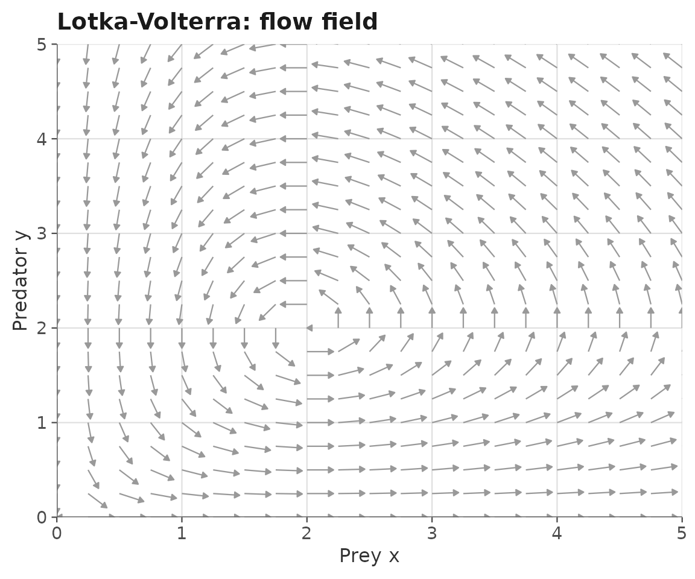

### 2.2 Adding nullclines

The x-nullcline (red, solid) and y-nullcline (blue, dashed) intersect at
the equilibria. Their visual intersection immediately reveals the
coexistence point $`(2, 2)`$.

``` r

gg_flow_field(
  ode_lotka_volterra,
  xlim       = c(0, 5),
  ylim       = c(0, 5),
  parameters = lv_params,
  xlab       = "Prey x",
  ylab       = "Predator y",
  title      = "Lotka-Volterra: flow field + nullclines"
) +
  gg_nullclines(
    ode_lotka_volterra,
    xlim            = c(0, 5),
    ylim            = c(0, 5),
    parameters      = lv_params,
    legend_position = "bottom"
  )
```

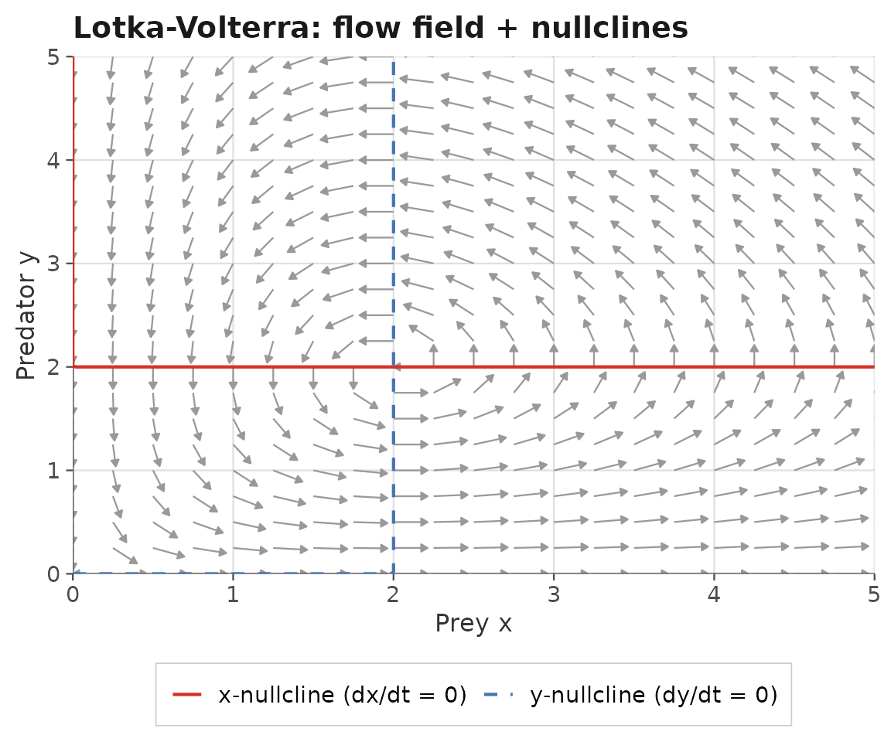

### 2.3 Adding trajectories

Trajectories show that solutions orbit the interior equilibrium
indefinitely — a signature of a neutrally stable center.

``` r

ics <- matrix(
  c(0.5, 0.5,
    1.0, 3.0,
    3.5, 0.5,
    3.0, 3.5),
  ncol = 2, byrow = TRUE
)

gg_flow_field(
  ode_lotka_volterra,
  xlim       = c(0, 5),
  ylim       = c(0, 5),
  parameters = lv_params,
  xlab       = "Prey x",
  ylab       = "Predator y",
  title      = "Lotka-Volterra: complete phase portrait"
) +
  gg_nullclines(
    ode_lotka_volterra,
    xlim            = c(0, 5),
    ylim            = c(0, 5),
    parameters      = lv_params,
    legend_position = "bottom"
  ) +
  gg_trajectory(
    ode_lotka_volterra,
    y0         = ics,
    xlim       = c(0, 5),
    ylim       = c(0, 5),
    parameters = lv_params,
    t_end      = 25,
    color      = "grey30",
    add_start_point = FALSE
  )
```

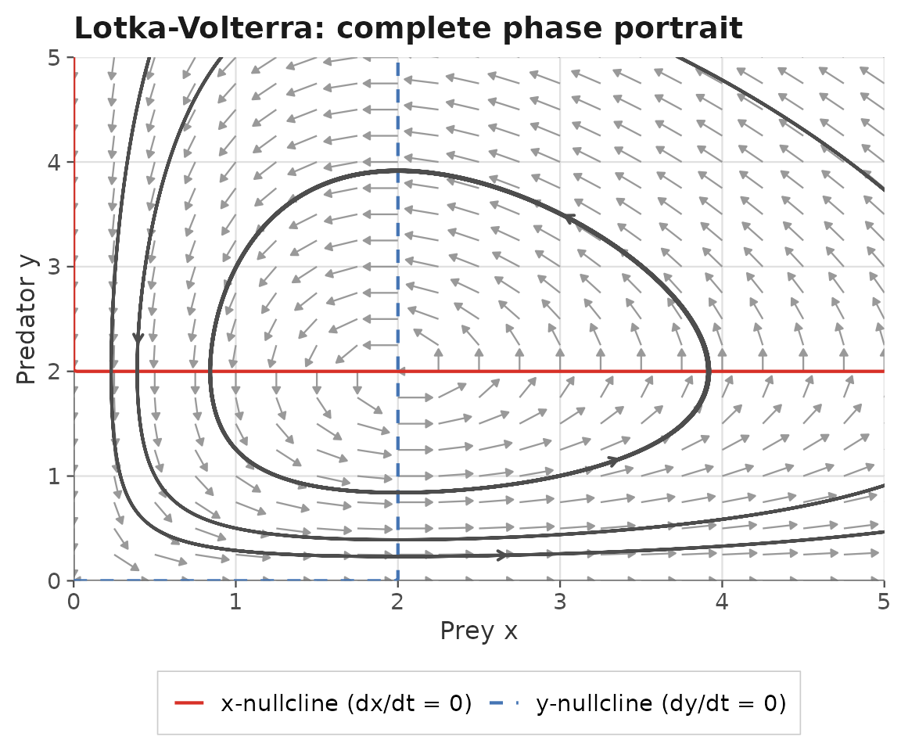

### 2.4 Time series

The corresponding time series shows the classic out-of-phase oscillation
between prey and predator:

``` r

gg_time_series(
  ode_lotka_volterra,
  y0         = c(1, 1),
  t_end      = 25,
  parameters = lv_params,
  var_labels = c("Prey x(t)", "Predator y(t)"),
  title      = "Lotka-Volterra: time series"
)
```

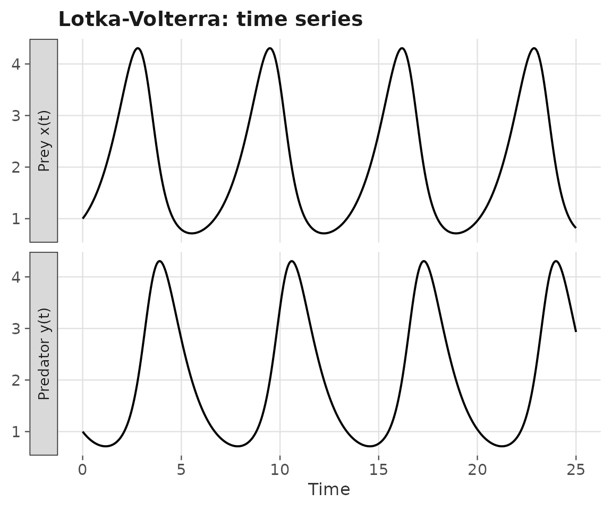

> **Technical aside:** The Lotka–Volterra interior equilibrium is a
> *center* — a special case where the linearization has purely imaginary
> eigenvalues ($`\lambda = \pm i\sqrt{\alpha\gamma}`$) and the Jacobian
> test is inconclusive about nonlinear stability. The orbits are in fact
> closed curves (a consequence of a conserved quantity), but this is not
> guaranteed by linearization alone. Compare with the Van der Pol
> oscillator in Section 5, which has a *stable limit cycle* that
> attracts all nearby trajectories.

------------------------------------------------------------------------

## 3 User-defined example: SIR epidemic model

The SIR (Susceptible–Infected–Recovered) model describes epidemic
dynamics in a closed population:

``` math
\frac{dS}{dt} = -\beta S I, \qquad
\frac{dI}{dt} = \beta S I - \gamma I,
```

where $`S + I + R = 1`$ (proportions), $`\beta > 0`$ is the transmission
rate, and $`\gamma > 0`$ is the recovery rate. The **basic reproduction
number** $`R_0 = \beta/\gamma`$ determines whether an epidemic occurs:
an epidemic grows when $`R_0 S > 1`$.

We define this as a Convention B ODE to illustrate the simplified
interface:

``` r

sir_ode <- function(x, y, parameters = NULL) {
  # x = S (susceptible proportion)
  # y = I (infected proportion)
  beta  <- parameters[["beta"]]
  gamma <- parameters[["gamma"]]
  c(
    -beta  * x * y,
     beta  * x * y - gamma * y
  )
}

sir_params <- c(beta = 0.5, gamma = 0.1)   # R0 = 5
```

``` r

gg_flow_field(
  sir_ode,
  xlim       = c(0, 1),
  ylim       = c(0, 0.3),
  parameters = sir_params,
  xlab       = "Susceptible S",
  ylab       = "Infected I",
  title      = "SIR model (R0 = 5): phase plane"
) +
  gg_nullclines(
    sir_ode,
    xlim            = c(0, 1),
    ylim            = c(0, 0.3),
    parameters      = sir_params,
    legend_position = "bottom"
  ) +
  gg_trajectory(
    sir_ode,
    y0         = list(c(0.99, 0.01), c(0.70, 0.01), c(0.30, 0.01)),
    xlim       = c(0, 1),
    ylim       = c(0, 0.3),
    parameters = sir_params,
    t_end      = 80,
    color      = "grey30",
    add_start_point = FALSE
  ) +
  # Mark the epidemic threshold S = 1/R0 = gamma/beta
  geom_vline(xintercept = sir_params["gamma"] / sir_params["beta"],
             linetype = "dotted", color = "firebrick") +
  annotate("text", x = 0.22, y = 0.28,
           label = "S = 1/R0", color = "firebrick", size = 3.5,
           hjust = 0)
```

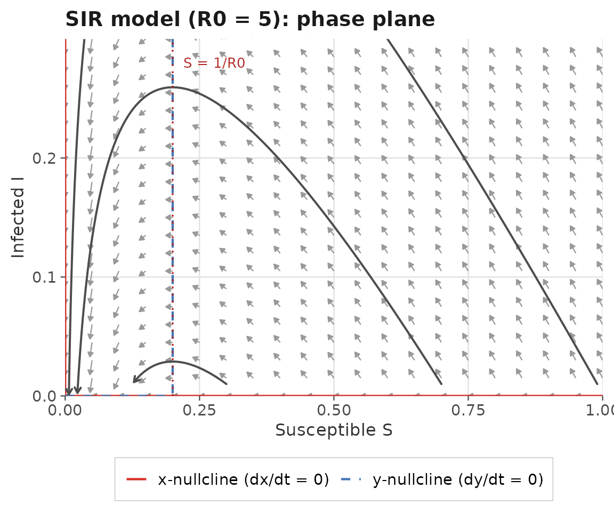

The vertical dotted line marks $`S = 1/R_0 = 0.2`$. Trajectories that
cross the x-nullcline (y-nullcline here is $`I = 0`$ or
$`S = \gamma/\beta`$) are at the epidemic peak; afterward $`I`$
declines. All trajectories end on the x-axis ($`I = 0`$) — the
disease-free states — confirming that the epidemic always burns out in a
closed population.

The built-in
[`ode_sir()`](https://jmgraham30.github.io/ggphasr/reference/ode_sir.md)
provides the same model with an additional `scale` parameter for
switching between proportions and absolute counts:

``` r

# Equivalent using the built-in system
gg_flow_field(
  ode_sir,
  xlim       = c(0, 1),
  ylim       = c(0, 0.3),
  parameters = sir_params,
  xlab       = "Susceptible S",
  ylab       = "Infected I",
  title      = "SIR model: built-in ode_sir()"
) +
  gg_nullclines(ode_sir,
                xlim            = c(0, 1),
                ylim            = c(0, 0.3),
                parameters      = sir_params,
                legend_position = "bottom")
```

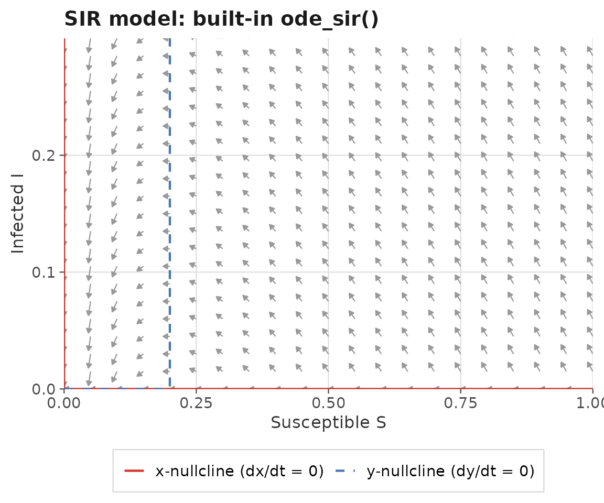

------------------------------------------------------------------------

## 4 The Van der Pol oscillator and limit cycles

The Van der Pol oscillator is a paradigmatic nonlinear oscillator with a
**stable limit cycle** — a closed trajectory that attracts all nearby
solutions:

``` math
\frac{dx}{dt} = y, \qquad
\frac{dy}{dt} = \mu(1 - x^2)y - x,
```

where $`\mu \geq 0`$ controls the strength of the nonlinear damping. For
$`\mu = 0`$ the system reduces to the harmonic oscillator with circular
orbits. For $`\mu > 0`$ a unique stable limit cycle exists; the origin
is an unstable spiral.

``` r

gg_flow_field(
  ode_van_der_pol,
  xlim       = c(-3, 3),
  ylim       = c(-4, 4),
  parameters = c(mu = 1),
  title      = "Van der Pol (mu = 1): phase plane"
) +
  gg_nullclines(
    ode_van_der_pol,
    xlim            = c(-3, 3),
    ylim            = c(-4, 4),
    parameters      = c(mu = 1),
    legend_position = "bottom"
  ) +
  gg_trajectory(
    ode_van_der_pol,
    y0         = list(c(0.1, 0.1),   # from inside
                      c(2.5,  0.0),  # from outside
                      c(-2.5, 0.0)),
    xlim       = c(-3, 3),
    ylim       = c(-4, 4),
    parameters = c(mu = 1),
    t_end      = 20,
    color      = "grey30",
    add_start_point = FALSE
  )
```

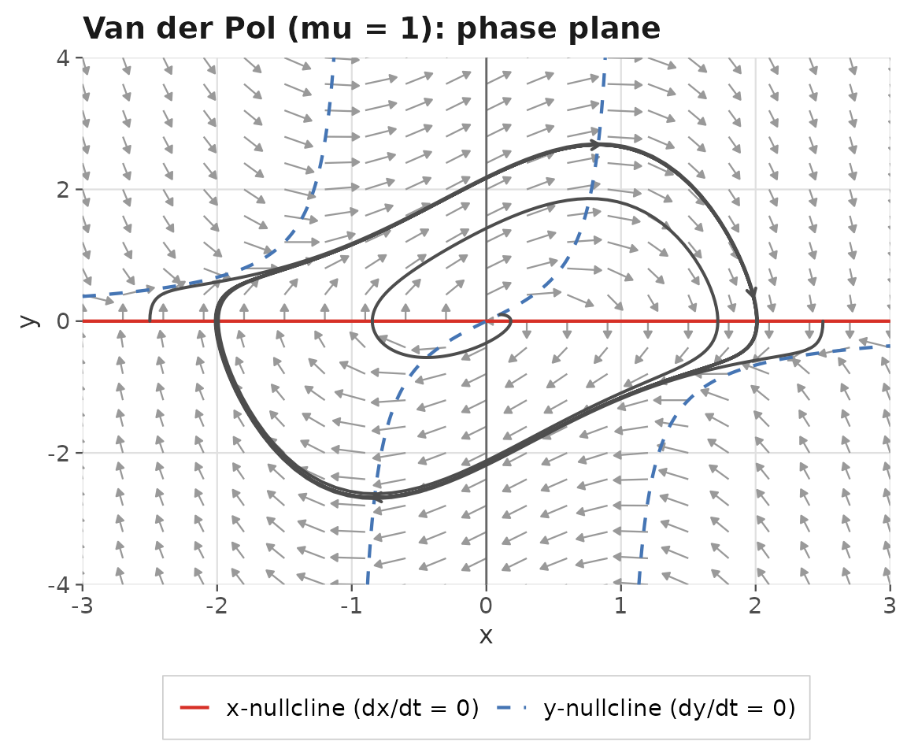

Both trajectories — one starting inside the limit cycle and one outside
— converge to the same closed orbit. This is the defining property of a
stable limit cycle.

### 4.1 Effect of mu on the waveform

As $`\mu`$ increases, the limit cycle shape becomes increasingly
non-circular, eventually producing the sharp jumps characteristic of a
**relaxation oscillator**:

``` r

make_vdp_ts <- function(mu) {
  gg_time_series(
    ode_van_der_pol,
    y0         = c(0.1, 0.1),
    t_end      = 30,
    parameters = c(mu = mu),
    var_labels = c("x", "y"),
    title      = paste0("mu = ", mu)
  )
}

if (requireNamespace("patchwork", quietly = TRUE)) {
  library(patchwork)
  make_vdp_ts(0.5) | make_vdp_ts(1) | make_vdp_ts(3)
} else {
  make_vdp_ts(1)
}
```

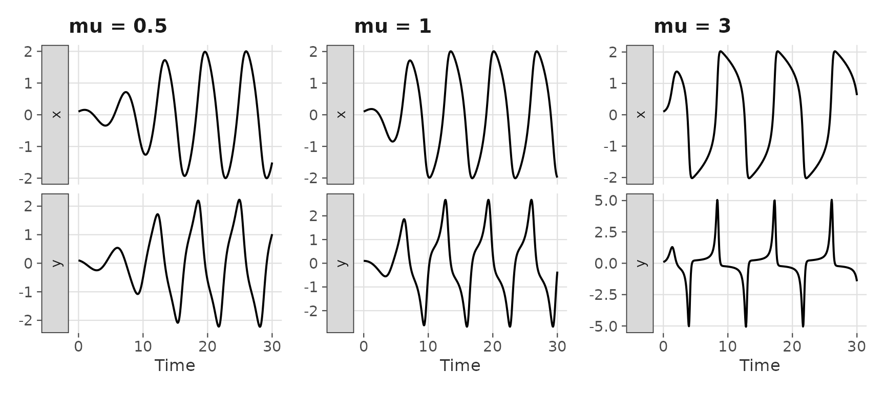

> **Technical aside:** The existence and uniqueness of the Van der Pol
> limit cycle follows from the Poincaré–Bendixson theorem combined with
> the Bendixson–Dulac criterion. The key insight is that the origin is
> an unstable spiral (tr $`J > 0`$ at the origin) and that trajectories
> are bounded, so by Poincaré–Bendixson there must be a periodic orbit.
> Uniqueness follows from the specific structure of the nonlinearity.

------------------------------------------------------------------------

## 5 Two-species competition and bistability

The Lotka–Volterra competition model describes two species competing for
the same resource:

``` math
\frac{dN_1}{dt} = r_1 N_1\!\left(1 - \frac{N_1 + \alpha_{12}N_2}{K_1}\right),
\qquad
\frac{dN_2}{dt} = r_2 N_2\!\left(1 - \frac{N_2 + \alpha_{21}N_1}{K_2}\right),
```

where $`\alpha_{12}`$ is the per-capita effect of species 2 on species
1, and vice versa. The four possible qualitative outcomes depend on the
relative magnitudes of the competition coefficients and carrying
capacities:

| Condition | Outcome |
|----|----|
| $`K_1/\alpha_{12} > K_2`$ and $`K_2/\alpha_{21} < K_1`$ | Species 1 wins |
| $`K_1/\alpha_{12} < K_2`$ and $`K_2/\alpha_{21} > K_1`$ | Species 2 wins |
| $`K_1/\alpha_{12} > K_2`$ and $`K_2/\alpha_{21} > K_1`$ | Stable coexistence |
| $`K_1/\alpha_{12} < K_2`$ and $`K_2/\alpha_{21} < K_1`$ | Bistability (priority effects) |

### 5.1 Stable coexistence

When interspecific competition is weaker than intraspecific competition,
a stable coexistence equilibrium exists:

``` r

params_coexist <- c(r1=1, r2=1, K1=10, K2=10, a12=0.5, a21=0.5)

gg_flow_field(
  ode_competition,
  xlim       = c(0, 12),
  ylim       = c(0, 12),
  parameters = params_coexist,
  xlab       = "Species 1 (N1)",
  ylab       = "Species 2 (N2)",
  title      = "Competition: stable coexistence"
) +
  gg_nullclines(
    ode_competition,
    xlim            = c(0, 12),
    ylim            = c(0, 12),
    parameters      = params_coexist,
    legend_position = "bottom"
  ) +
  gg_trajectory(
    ode_competition,
    y0         = list(c(1,9), c(9,1), c(1,1), c(9,9)),
    xlim       = c(0, 12),
    ylim       = c(0, 12),
    parameters = params_coexist,
    t_end      = 20,
    color      = "grey30",
    add_start_point = FALSE
  )
```

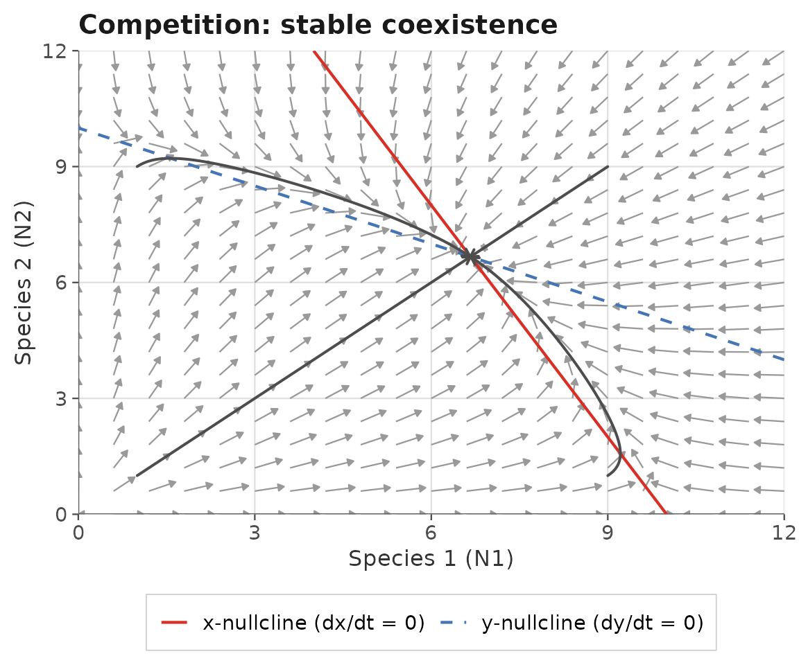

### 5.2 Bistability (priority effects)

When interspecific competition is stronger than intraspecific
competition, the coexistence equilibrium becomes an unstable saddle and
two stable single-species equilibria emerge. Which species wins depends
entirely on initial conditions — this is called **priority effects** or
**founder control**:

``` r

params_bistable <- c(r1=1, r2=1, K1=10, K2=10, a12=1.5, a21=1.5)

result_bistable <- gg_phase_plane(
  ode_competition,
  xlim            = c(0, 12),
  ylim            = c(0, 12),
  parameters      = params_bistable,
  t_end           = 20,
  n_ic            = 5,
  title           = "Competition: bistability (priority effects)",
  legend_position = "bottom"
)
result_bistable$plot +
  labs(x = "Species 1 (N1)", y = "Species 2 (N2)")
```

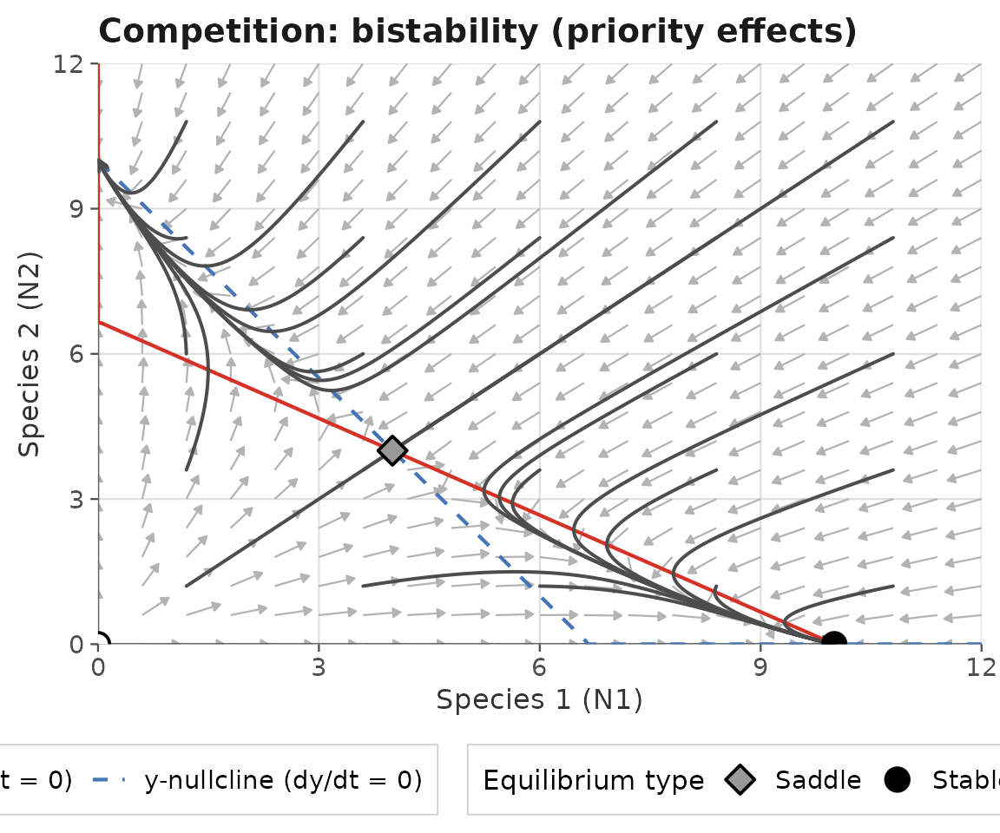

``` r

result_bistable$equilibria[, c("x", "y", "classification")]
#>               x  y classification
#> 1 -1.427043e-11 10    Stable node
#> 2  0.000000e+00  0  Unstable node
#> 3  4.000000e+00  4         Saddle
#> 4  1.000000e+01  0    Stable node
```

The saddle point at the interior equilibrium divides the phase plane
into two **basins of attraction**. Its stable manifold is the separatrix
— trajectories on one side converge to species 1 winning, those on the
other side to species 2 winning.

### 5.3 Visualizing the separatrix with gg_manifolds()

``` r

# Extract the saddle from the equilibrium table
saddle_row <- result_bistable$equilibria[
  result_bistable$equilibria$classification == "Saddle", ]
saddle_eq  <- c(saddle_row$x[[1L]], saddle_row$y[[1L]])

result_bistable$plot +
  gg_manifolds(
    ode_competition,
    equilibrium = saddle_eq,
    parameters  = params_bistable,
    t_manifold  = 8
  ) +
  labs(x     = "Species 1 (N1)",
       y     = "Species 2 (N2)",
       title = "Competition: bistability with separatrix")
```

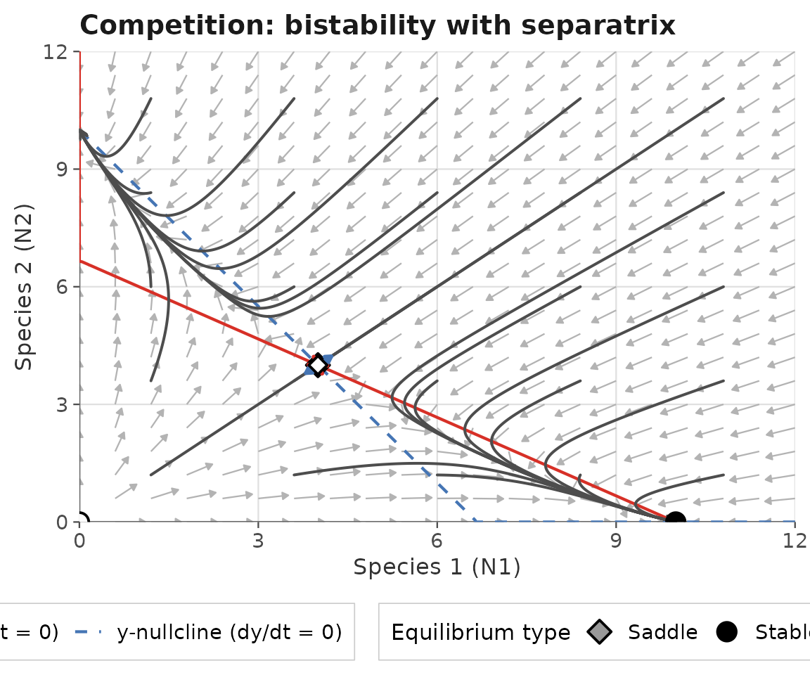

The blue dashed curves (stable manifold) form the separatrix.
Trajectories starting above it converge to species 2 winning; those
below converge to species 1 winning.

------------------------------------------------------------------------

## 6 The simple pendulum

The simple pendulum illustrates how a 2D phase plane can represent a
second-order ODE. Writing $`\theta`$ for the angle from vertical and
$`\omega = d\theta/dt`$ for the angular velocity:

``` math
\frac{d\theta}{dt} = \omega, \qquad
\frac{d\omega}{dt} = -\frac{g}{L}\sin\theta - b\,\omega,
```

where $`g/L`$ is the ratio of gravitational acceleration to pendulum
length and $`b \geq 0`$ is a damping coefficient.

The equilibria are at $`(\theta, \omega) = (k\pi, 0)`$ for integer
$`k`$. Even multiples of $`\pi`$ are stable (pendulum hanging down); odd
multiples are unstable saddles (pendulum balanced upright).

``` r

gg_flow_field(
  ode_simple_pendulum,
  xlim       = c(-pi, pi),
  ylim       = c(-3, 3),
  parameters = c(gL = 1, b = 0),
  n_points   = 25,
  xlab       = "Angle theta (radians)",
  ylab       = "Angular velocity omega",
  title      = "Simple pendulum: undamped (b = 0)"
) +
  gg_nullclines(
    ode_simple_pendulum,
    xlim            = c(-pi, pi),
    ylim            = c(-3, 3),
    parameters      = c(gL = 1, b = 0),
    legend_position = "bottom"
  ) +
  gg_trajectory(
    ode_simple_pendulum,
    y0         = list(c(0.5, 0), c(1.5, 0), c(2.5, 0)),
    xlim       = c(-pi, pi),
    ylim       = c(-3, 3),
    parameters = c(gL = 1, b = 0),
    t_end      = 12,
    color      = "grey30",
    add_start_point = FALSE
  ) +
  scale_x_continuous(
    breaks = c(-pi, -pi/2, 0, pi/2, pi),
    labels = c("-pi", "-pi/2", "0", "pi/2", "pi")
  )
```

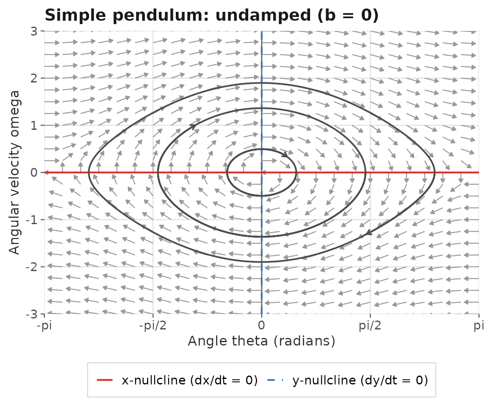

``` r

gg_flow_field(
  ode_simple_pendulum,
  xlim       = c(-pi, pi),
  ylim       = c(-3, 3),
  parameters = c(gL = 1, b = 0.5),
  n_points   = 25,
  xlab       = "Angle theta (radians)",
  ylab       = "Angular velocity omega",
  title      = "Simple pendulum: damped (b = 0.5)"
) +
  gg_nullclines(
    ode_simple_pendulum,
    xlim            = c(-pi, pi),
    ylim            = c(-3, 3),
    parameters      = c(gL = 1, b = 0.5),
    legend_position = "bottom"
  ) +
  gg_trajectory(
    ode_simple_pendulum,
    y0         = list(c(0.5, 0), c(1.5, 0), c(2.5, 0)),
    xlim       = c(-pi, pi),
    ylim       = c(-3, 3),
    parameters = c(gL = 1, b = 0.5),
    t_end      = 15,
    color      = "grey30",
    add_start_point = FALSE
  ) +
  scale_x_continuous(
    breaks = c(-pi, -pi/2, 0, pi/2, pi),
    labels = c("-pi", "-pi/2", "0", "pi/2", "pi")
  )
```

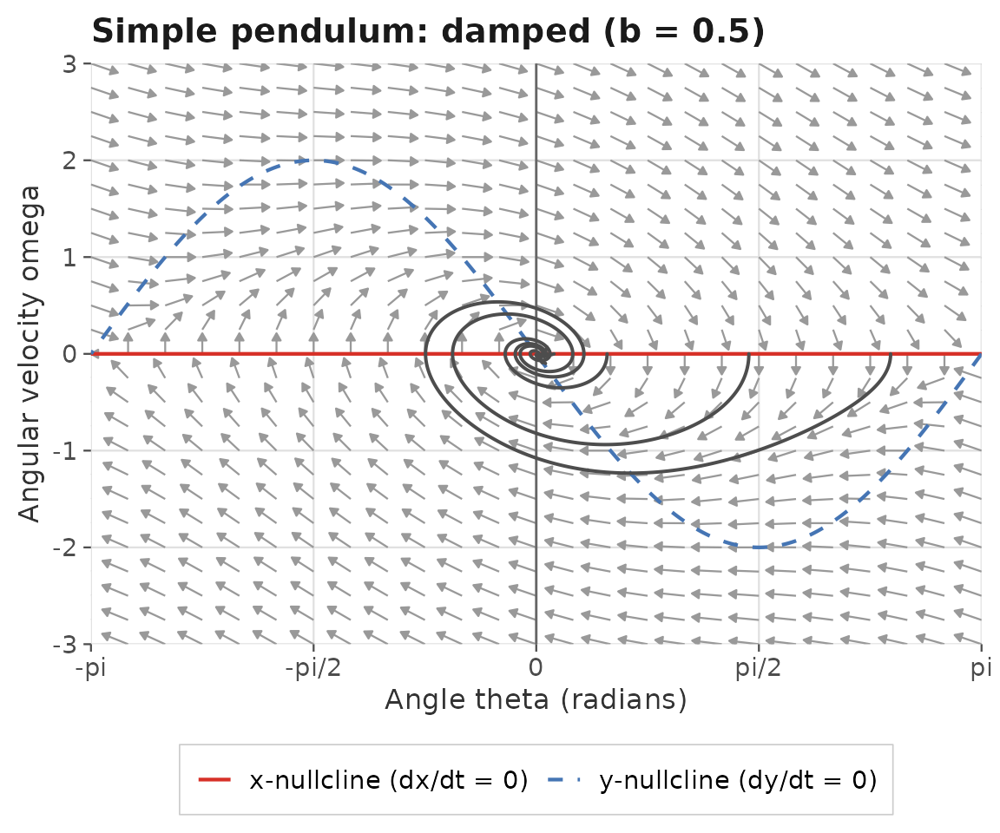

With damping, the stable equilibria at $`\theta = 0`$ become stable
spirals (for small $`b`$) or stable nodes (for large $`b`$), and the
heteroclinic orbits connecting the saddles at $`\pm\pi`$ break up into
spiraling trajectories.

------------------------------------------------------------------------

## 7 Customizing phase plane plots

Because all `gg_*` functions return standard ggplot2 objects or layer
lists, full ggplot2 customization is available. Here we demonstrate
several common customizations on the Lotka–Volterra system:

``` r

# When color_by_magnitude = TRUE, gg_flow_field() uses a continuous color
# scale for arrow magnitude. To avoid a scale conflict, gg_nullclines()
# must use add_legend = FALSE so it draws fixed-color lines without
# adding a competing discrete color scale.
gg_flow_field(
  ode_lotka_volterra,
  xlim               = c(0, 5),
  ylim               = c(0, 5),
  parameters         = lv_params,
  arrow_type         = "proportional",
  color_by_magnitude = TRUE,
  magnitude_palette  = c("grey90", "#2c7bb6"),
  n_points           = 25
) +
  gg_nullclines(
    ode_lotka_volterra,
    xlim       = c(0, 5),
    ylim       = c(0, 5),
    parameters = lv_params,
    x_color    = "#d73027",
    y_color    = "#1a9641",
    linewidth  = 1.2,
    add_legend = FALSE       # avoids discrete/continuous scale conflict
  ) +
  gg_trajectory(
    ode_lotka_volterra,
    y0         = list(c(1, 0.5), c(3.5, 0.5), c(0.5, 3)),
    xlim       = c(0, 5),
    ylim       = c(0, 5),
    parameters = lv_params,
    t_end      = 25,
    color      = "black",
    linewidth  = 0.9,
    add_start_point = FALSE
  ) +
  geom_point(
    data    = data.frame(x = 2, y = 2),
    mapping = aes(x = x, y = y),
    shape = 21, fill = "white", color = "black", size = 4, stroke = 1.2
  ) +
  labs(
    x     = "Prey x(t)",
    y     = "Predator y(t)",
    title = "Lotka-Volterra: customized phase portrait",
    color = "Speed"
  )
```

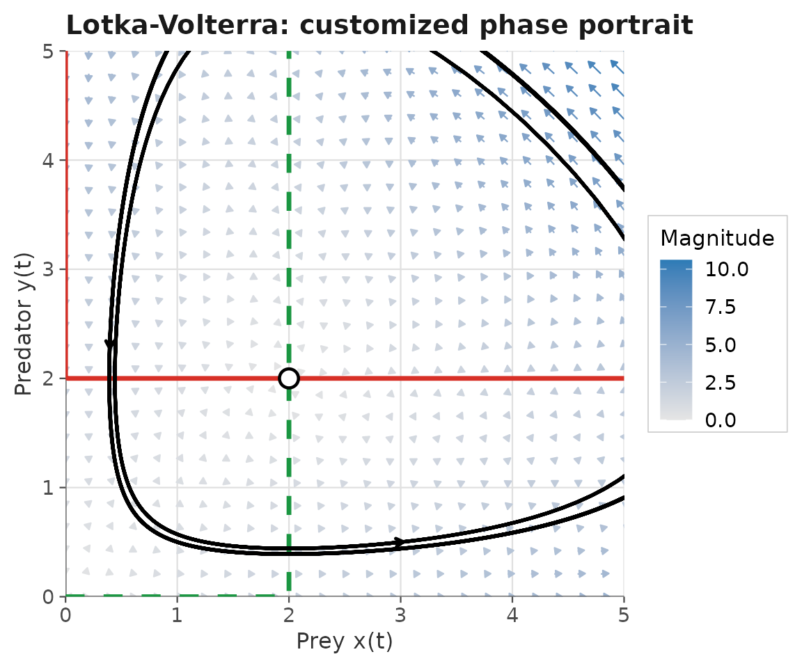

------------------------------------------------------------------------

## Summary

This vignette covered the complete `ggphasr` workflow for 2D autonomous
ODE systems across four classical models:

| System         | Key feature illustrated                     |
|----------------|---------------------------------------------|
| Lotka–Volterra | Neutrally stable center, closed orbits      |
| SIR epidemic   | Disease-free saddle, epidemic threshold     |
| Van der Pol    | Stable limit cycle, relaxation oscillations |
| Competition    | Bistability, separatrix, manifolds          |
| Pendulum       | Second-order ODE as 2D system, damping      |

The composable layer approach —
`gg_flow_field() + gg_nullclines() + gg_trajectory()` — makes it
straightforward to build up a phase portrait incrementally, while
[`gg_phase_plane()`](https://jmgraham30.github.io/ggphasr/reference/gg_phase_plane.md)
provides a quick all-in-one view for initial exploration.

The next vignette, *Equilibrium Analysis*, goes deeper into the
analytical tools: finding all equilibria numerically, classifying them
via the trace-determinant plane, and drawing stable and unstable
manifolds of saddle points.
