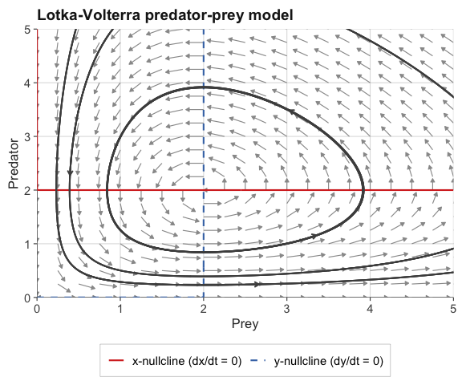
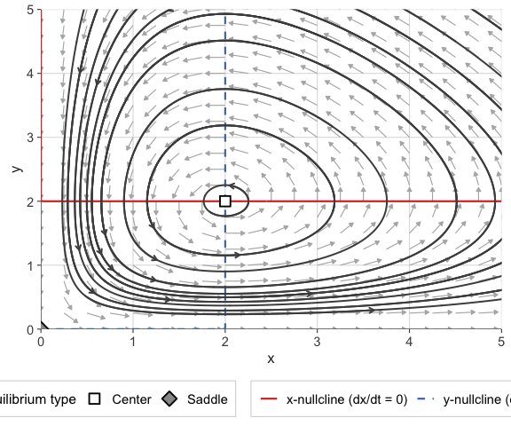
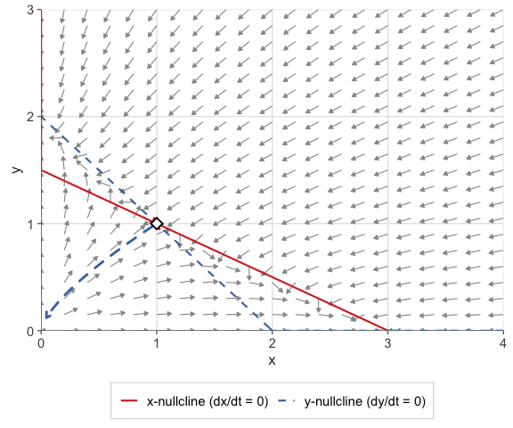

# ggphasr

`ggphasr` provides tools for qualitative analysis of one- and
two-dimensional autonomous ordinary differential equation (ODE) systems
using phase plane methods. All visualizations are produced with
[ggplot2](https://ggplot2.tidyverse.org/) and its extensions, making
every plot fully customizable with standard `ggplot2` syntax.

`ggphasr` is a modern successor to the
[phaseR](https://github.com/mjg211/phaseR) package (Grayling, 2014),
where base R graphics are replaced with `ggplot2`.

## Installation

Install the development version from GitHub:

``` r

# install.packages("remotes")
remotes::install_github("jmgraham30/ggphasr")
```

## Quick start

`ggphasr` functions compose naturally with the `+` operator, just like
`ggplot2` itself. A complete phase portrait is built layer by layer:

``` r

library(ggphasr)
library(ggplot2)

lv_params <- c(alpha = 1, beta = 0.5, delta = 0.5, gamma = 1)

gg_flow_field(
  ode_lotka_volterra,
  xlim       = c(0, 5),
  ylim       = c(0, 5),
  parameters = lv_params,
  xlab       = "Prey",
  ylab       = "Predator",
  title      = "Lotka-Volterra predator-prey model"
) +
  gg_nullclines(
    ode_lotka_volterra,
    xlim            = c(0, 5),
    ylim            = c(0, 5),
    parameters      = lv_params,
    legend_position = "bottom"
  ) +
  gg_trajectory(
    ode_lotka_volterra,
    y0         = matrix(c(0.5, 0.5,
                          1.0, 3.0,
                          3.5, 0.5,
                          3.0, 3.5),
                        ncol = 2, byrow = TRUE),
    xlim       = c(0, 5),
    ylim       = c(0, 5),
    parameters = lv_params,
    t_end      = 25,
    color      = "grey30",
    add_start_point = FALSE
  )
```



For quick exploration,
[`gg_phase_plane()`](https://jmgraham30.github.io/ggphasr/reference/gg_phase_plane.md)
produces a complete analysis — flow field, nullclines, trajectories, and
classified equilibria — in a single call:

``` r

result <- gg_phase_plane(
  ode_lotka_volterra,
  xlim            = c(0, 5),
  ylim            = c(0, 5),
  parameters      = lv_params,
  legend_position = "bottom"
)

result$plot
```



``` r


result$equilibria[, c("x", "y", "classification")]
#>   x y classification
#> 1 0 0         Saddle
#> 2 2 2         Center
```

## ODE conventions

`ggphasr` accepts ODE functions in two calling conventions.

**Convention A** — deSolve-compatible (recommended for compatibility
with [`deSolve::ode()`](https://rdrr.io/pkg/deSolve/man/ode.html)):

``` r

my_ode <- function(t, y, parameters) {
  list(c(dy1, dy2))
}
```

**Convention B** — simplified, for quick exploration:

``` r

my_ode <- function(x, y, parameters = NULL) {
  c(dx, dy)
}
```

The convention is detected automatically from the function’s argument
names. All built-in ODE systems use Convention A.

## Function overview

### Plotting functions

| Function | Returns | Description |
|----|----|----|
| [`gg_flow_field()`](https://jmgraham30.github.io/ggphasr/reference/gg_flow_field.md) | `ggplot` | Direction/velocity field arrows |
| [`gg_nullclines()`](https://jmgraham30.github.io/ggphasr/reference/gg_nullclines.md) | layer list | Zero-isocline curves |
| [`gg_trajectory()`](https://jmgraham30.github.io/ggphasr/reference/gg_trajectory.md) | layer list | Numerically integrated trajectories |
| [`gg_phase_portrait()`](https://jmgraham30.github.io/ggphasr/reference/gg_phase_portrait.md) | layer list | 1D phase line with stability markers |
| [`gg_time_series()`](https://jmgraham30.github.io/ggphasr/reference/gg_time_series.md) | `ggplot` | Time-series plots of state variables |
| [`gg_manifolds()`](https://jmgraham30.github.io/ggphasr/reference/gg_manifolds.md) | layer list | Stable/unstable manifolds of saddles |
| [`gg_phase_plane()`](https://jmgraham30.github.io/ggphasr/reference/gg_phase_plane.md) | `ggphasr_result` | All-in-one phase plane wrapper |

### Analysis functions

| Function | Returns | Description |
|----|----|----|
| [`find_equilibrium()`](https://jmgraham30.github.io/ggphasr/reference/find_equilibrium.md) | list of vectors | Newton–Raphson equilibrium finding |
| [`classify_equilibrium()`](https://jmgraham30.github.io/ggphasr/reference/classify_equilibrium.md) | data frame | Trace-determinant stability classification |
| [`add_layer()`](https://jmgraham30.github.io/ggphasr/reference/add_layer.md) | `ggphasr_result` | Add ggplot2 layers to a `ggphasr_result` |

### Built-in ODE systems

**1D models:**
[`ode_exponential()`](https://jmgraham30.github.io/ggphasr/reference/ode_exponential.md),
[`ode_logistic()`](https://jmgraham30.github.io/ggphasr/reference/ode_logistic.md),
[`ode_monomolecular()`](https://jmgraham30.github.io/ggphasr/reference/ode_monomolecular.md),
[`ode_von_bertalanffy()`](https://jmgraham30.github.io/ggphasr/reference/ode_von_bertalanffy.md)

**2D models:**
[`ode_lotka_volterra()`](https://jmgraham30.github.io/ggphasr/reference/ode_lotka_volterra.md),
[`ode_sir()`](https://jmgraham30.github.io/ggphasr/reference/ode_sir.md),
[`ode_van_der_pol()`](https://jmgraham30.github.io/ggphasr/reference/ode_van_der_pol.md),
[`ode_simple_pendulum()`](https://jmgraham30.github.io/ggphasr/reference/ode_simple_pendulum.md),
[`ode_competition()`](https://jmgraham30.github.io/ggphasr/reference/ode_competition.md),
[`ode_toggle()`](https://jmgraham30.github.io/ggphasr/reference/ode_toggle.md),
[`ode_morris_lecar()`](https://jmgraham30.github.io/ggphasr/reference/ode_morris_lecar.md),
[`ode_lindemann()`](https://jmgraham30.github.io/ggphasr/reference/ode_lindemann.md)

**Textbook examples:**
[`ode_example_01()`](https://jmgraham30.github.io/ggphasr/reference/ode_example_01.md)
through
[`ode_example_15()`](https://jmgraham30.github.io/ggphasr/reference/ode_example_15.md)

## Equilibrium analysis

[`find_equilibrium()`](https://jmgraham30.github.io/ggphasr/reference/find_equilibrium.md)
and
[`classify_equilibrium()`](https://jmgraham30.github.io/ggphasr/reference/classify_equilibrium.md)
provide a complete numerical workflow for locating and classifying
equilibria:

``` r

# Find all equilibria of the competition model by grid search
eq_list <- find_equilibrium(
  ode_competition,
  y0         = NULL,
  xlim       = c(0, 12),
  ylim       = c(0, 12),
  parameters = c(r1=1, r2=1, K1=10, K2=10, a12=0.5, a21=0.5)
)

# Classify each equilibrium
do.call(rbind, lapply(eq_list, function(eq) {
  classify_equilibrium(ode_competition, equilibrium = eq,
                       parameters = c(r1=1, r2=1, K1=10, K2=10,
                                      a12=0.5, a21=0.5))
}))[, c("x", "y", "classification", "tr", "det")]
#>               x         y classification         tr        det
#> 1 -4.425602e-10 10.000000         Saddle -0.5000002 -0.4999999
#> 2  0.000000e+00  0.000000  Unstable node  1.9999998  0.9999998
#> 3  6.666667e+00  6.666667    Stable node -1.3333335  0.3333335
#> 4  1.000000e+01  0.000000         Saddle -0.5000002 -0.4999999
```

## Stable and unstable manifolds

[`gg_manifolds()`](https://jmgraham30.github.io/ggphasr/reference/gg_manifolds.md)
traces the stable and unstable manifolds of saddle points, revealing the
separatrices that organize the phase plane into basins of attraction:

``` r

eq    <- find_equilibrium(ode_example_11, y0 = c(0.8, 0.8))
eq_cl <- classify_equilibrium(ode_example_11, equilibrium = eq[[1L]])

gg_flow_field(ode_example_11,
              xlim = c(0, 4), ylim = c(0, 3)) +
  gg_nullclines(ode_example_11,
                xlim            = c(0, 4),
                ylim            = c(0, 3),
                legend_position = "bottom") +
  gg_manifolds(ode_example_11,
               equilibrium   = eq[[1L]],
               eq_classified = eq_cl,
               t_manifold    = 5)
#> DLSODA-  Warning..Internal T (=R1) and H (=R2) are
#>       such that in the machine, T + H = T on the next step  
#>      (H = step size). Solver will continue anyway.
#> In above message, R1 = -3.96058, R2 = -1.90518e-16
#>  
#> DLSODA-  Warning..Internal T (=R1) and H (=R2) are
#>       such that in the machine, T + H = T on the next step  
#>      (H = step size). Solver will continue anyway.
#> In above message, R1 = -3.96058, R2 = -1.90518e-16
#>  
#> DLSODA-  Warning..Internal T (=R1) and H (=R2) are
#>       such that in the machine, T + H = T on the next step  
#>      (H = step size). Solver will continue anyway.
#> In above message, R1 = -3.96058, R2 = -1.90518e-16
#>  
#> DLSODA-  Warning..Internal T (=R1) and H (=R2) are
#>       such that in the machine, T + H = T on the next step  
#>      (H = step size). Solver will continue anyway.
#> In above message, R1 = -3.96058, R2 = -1.52334e-16
#>  
#> DLSODA-  Warning..Internal T (=R1) and H (=R2) are
#>       such that in the machine, T + H = T on the next step  
#>      (H = step size). Solver will continue anyway.
#> In above message, R1 = -3.96058, R2 = -1.52334e-16
#>  
#> DLSODA-  Warning..Internal T (=R1) and H (=R2) are
#>       such that in the machine, T + H = T on the next step  
#>      (H = step size). Solver will continue anyway.
#> In above message, R1 = -3.96058, R2 = -1.26208e-16
#>  
#> DLSODA-  Warning..Internal T (=R1) and H (=R2) are
#>       such that in the machine, T + H = T on the next step  
#>      (H = step size). Solver will continue anyway.
#> In above message, R1 = -3.96058, R2 = -1.26208e-16
#>  
#> DLSODA-  Warning..Internal T (=R1) and H (=R2) are
#>       such that in the machine, T + H = T on the next step  
#>      (H = step size). Solver will continue anyway.
#> In above message, R1 = -3.96058, R2 = -1.26208e-16
#>  
#> DLSODA-  Warning..Internal T (=R1) and H (=R2) are
#>       such that in the machine, T + H = T on the next step  
#>      (H = step size). Solver will continue anyway.
#> In above message, R1 = -3.96058, R2 = -1.00913e-16
#>  
#> DLSODA-  Warning..Internal T (=R1) and H (=R2) are
#>       such that in the machine, T + H = T on the next step  
#>      (H = step size). Solver will continue anyway.
#> In above message, R1 = -3.96058, R2 = -1.00913e-16
#>  
#> DLSODA-  Above warning has been issued I1 times.  
#>      It will not be issued again for this problem.
#> In above message, I1 = 10
#>  
#> DINTDY-  T (=R1) illegal      
#> In above message, R1 = -3.96794
#>  
#>       T not in interval TCUR - HU (= R1) to TCUR (=R2)      
#> In above message, R1 = -3.96058, R2 = -3.96058
#>  
#> DINTDY-  T (=R1) illegal      
#> In above message, R1 = -3.97796
#>  
#>       T not in interval TCUR - HU (= R1) to TCUR (=R2)      
#> In above message, R1 = -3.96058, R2 = -3.96058
#>  
#> DLSODA-  Trouble in DINTDY.  ITASK = I1, TOUT = R1
#> In above message, I1 = 1
#>  
#> In above message, R1 = -3.97796
#> 
```



## Vignettes

Three vignettes provide detailed tutorials with full mathematical
exposition:

- [**One-Dimensional ODE
  Systems**](https://jmgraham30.github.io/ggphasr/articles/one-dimensional-systems.html)
  — phase lines, equilibria, stability, the logistic and von Bertalanffy
  growth models
- [**Two-Dimensional ODE
  Systems**](https://jmgraham30.github.io/ggphasr/articles/two-dimensional-systems.html)
  — phase planes, nullclines, trajectories, Lotka-Volterra, SIR, Van der
  Pol, competition
- [**Equilibrium
  Analysis**](https://jmgraham30.github.io/ggphasr/articles/equilibrium-analysis.html)
  — Jacobian linearization, the trace-determinant plane, manifolds,
  bifurcation preview

## Citation

If you use `ggphasr` in your teaching or research, please cite it as:

``` r

citation("ggphasr")
```

`ggphasr` builds on the foundations laid by `phaseR`:

> Grayling MJ (2014). phaseR: An R Package for Phase Plane Analysis of
> Autonomous ODE Systems. *The R Journal* **6**(2): 43–51.
> <https://doi.org/10.32614/RJ-2014-023>

## License

MIT © Jason M. Graham
